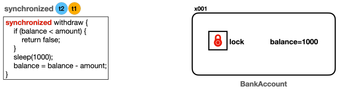

# 자바 고급편 (1)

## 멀티태스킹(MultiTasking) vs 멀티프로세싱(MultiProcessing)

<details>
   <summary> 정리 (📖 Click)</summary>
<br />

* 멀티태스킹
  * 운영체제 소프트웨어의 관점
  * 단일 CPU가 여러 작업을 동시에 수행하는 것처럼 보이게 하는 것
  * 소프트웨어 기반으로 CPU 시간을 분할하여 각 작업에 할당한다.

* 멀티프로세싱
  * 하드웨어 장비의 관점 
  * 여러 CPU를 사용하여 동시에 여러 작업을 수행하는 것

-----------------------
</details>

## 프로세스와 쓰레드

<details>
   <summary> 정리 (📖 Click)</summary>
<br />

* 프로세스
  * 실행 중인 프로그램
  * 각 프로세스는 독립적인 메모리 공간을 보유하며 운영체제에서 별도의 작업 단위로 분리해서 관리된다.
  * 각 프로세스는 별도의 메모리 공간을 가지기 때문에 서로 간섭하지 않는다.
  * 프로세스는 서로 격리되어 관리되기 때문에 하나의 프로세스가 충돌해도 다른 프로세스에는 영향을 미치지 않는다.
  * 특정 프로세스에 심각한 문제가 발생하면 해당 프로세스만 종료되고 다른 프로세스에 영향을 주지 않는다.


* 프로세스 구성
  * 코드 : 실행할 프로그램의 코드가 저장되는 부분
  * 힙 : 동적으로 할당되는 메모리 영역
  * 스택 : 메서드 호출 시 생성되는 지역 변수와 반환 주소가 저장되는 영역
  * 데이터 : 전역 변수 및 정적 변수가 저장되는 부분

* 쓰레드
  * 프로세스는 하나 이상의 쓰레드를 반드시 포함한다.
  * 모든 쓰레드는 프로세스 내의 코드, 데이터, 힙을 공유한다.
  * 각 쓰레드는 개별 스택을 가지고 있다.

* 단일 쓰레드 vs 멀티 쓰레드
  * 단일 쓰레드 : 한 프로세스 내에 하나의 쓰레드만 존재
  * 멀티 쓰레드 : 한 프로세스 내에 여러 쓰레드가 존재

-----------------------
</details>

## 컨텍스트 스위칭

<details>
   <summary> 정리 (📖 Click)</summary>
<br />

* 현재 작업하는 문맥을 변경하는 것
  * 예를 들어, 쓰레드 A와 쓰레드 B가 있다고 가정하자.
  * 쓰레드 A를 잠시 멈추고 쓰레드 B를 실행하고자 할 때, 쓰레드 B의 작업이 끝나고 쓰레드 A로 그냥 돌아갈 수 없다.
  * CPU에서 쓰레드를 실행하는데, 쓰레드 A의 코드가 어디까지 수행되었는지 위치를 찾아야 한다.
  * 또한 쓰레드 A에서 계산하던 변수들의 값을 다시 CPU로 불러들여야 한다.
  * 이런 과정을 컨텍스트 스위칭이라고 한다.

* 컨텍스트 스위칭 시 걸리는 시간은 아주 짧으나 쓰레드가 매우 많아지게 된다면 이 비용이 커질 수 있다.
<p>

* CPU 바운드 작업 vs I/O 바운드 작업
  * CPU 바운드 작업
    * CPU의 연산 능력을 많이 요구하는 작업
    * 이러한 작업은 주로 계산, 데이터 처리, 알고리즘 실행 등 CPU 처리 속도가 작업 완료 시간을 결정하는 경우
  * I/O 바운드 작업
    * 디스크, 네트워크, 파일 시스템 등과 같은 입출력(I/O) 작업을 많이 요구하는 작업
    * 이런 작업은 I/O 작업이 완료될 때까지 대기 시간이 많이 발생하며, CPU는 상대적으로 유휴 상태에 있는 경우가 많다.
    * 데이터베이스 쿼리 처리, 파일 읽기/쓰기, 네트워크 통신, 사용자 입력 처리

-----------------------
</details>

## 쓰레드

<details>
   <summary> 정리 (📖 Click)</summary>
<br />

* 쓰레드 간 실행 순서는 보장되지 않는다.
* `start()` vs `run()`


* **실행 결과를 보면 새로 생성한 쓰레드가 `run()`을 실행하는 것이 아니라 `main` 쓰레드가 `run()`을 실행하는 것을 볼 수 있다.**
* 자바를 처음 실행하면 `main` 쓰레드가 `main()` 메서드를 호출하면서 시작한다.
* `main` 쓰레드가 HelloThread에 있는 `run()`이라는 메서드를 호출한다.
* `main` 쓰레드가 `run()` 메서드를 실행했기 때문에 `main` 쓰레드가 사용하는 스택 위에 `run()` 스택 프레임이 올라간다.
* 결론 : `start()` 메서드를 호출해야지 `run()` 메서드를 호출하면 안 된다.

-----------------------
</details>

## 데몬 쓰레드

<details>
   <summary> 정리 (📖 Click)</summary>
<br />

* 백그라운드에서 보조적인 작업을 수행하는 쓰레드
* 모든 사용자 쓰레드가 종료되면 데몬 쓰레드는 자동으로 종료된다.
* JVM은 데몬 쓰레드의 실행 완료를 기다리지 않고 종료된다. 데몬 쓰레드가 아닌 모든 쓰레드가 종료되면 자바 프로그램도 종료된다.

```java
package thread;

public class DaemonThreadMain {
	public static void main(String[] args) {
		System.out.println(Thread.currentThread().getName() + ": Main 쓰레드 실행");

		DaemonThread daemonThread = new DaemonThread();
		daemonThread.setDaemon(true);	// 데몬 쓰레드 여부
		daemonThread.start();

		System.out.println(Thread.currentThread().getName() + ": Main 쓰레드 종료");
	}

	static class DaemonThread extends Thread {

		@Override
		public void run() {
			System.out.println(Thread.currentThread().getName() + ": 데몬 쓰레드 실행");
			try {
				Thread.sleep(10000);
			} catch (InterruptedException e) {
				throw new RuntimeException(e);
			}
			System.out.println(Thread.currentThread().getName() + ": 데몬 쓰레드 종료");
		}
	}
}
```

* 위와 같이 `setDaemon()`를 `true`로 지정하여 데몬 쓰레드로 만들면 Main 쓰레드가 데몬 쓰레드를 기다리지 않는다.
* 하지만 `false`로 지정하면 데몬 쓰레드가 아닌 사용자 쓰레드가 되므로 Main 쓰레드는 모든 쓰레드가 끝날 때까지 기다리게 된다.

-----------------------
</details>

## 쓰레드 생성 - Thread 상속, Runnable 인터페이스 구현

<details>
   <summary> 정리 (📖 Click)</summary>
<br />

* 쓰레드를 사용하는 방법으로는 두 가지 방법이 있다.
  * Thread 클래스를 상속받기
  * Runnable 인터페이스를 구현하기
* 위와 같은 두 가지 방법이 존재하지만 쓰레드를 생성할 때는 Thread 클래스를 상속하는 방법보다 Runnable 인터페이스를 구현하는 방식이 더 나은 선택이다.

<p>

* Thread 클래스 상속 방식
  * 장점
    * 간단한 구현 : Thread 클래스를 상속받아 `run()` 메서드만 재정의하면 된다.
  * 단점
    * 상속의 제한 : 자바는 단일 상속만을 허용(다이아몬드 문제 때문에)하므로 이미 다른 클래스를 상속받고 있는 경우 Thread 클래스를 상속받기 어렵다.
    * 유연성 부족 : 인터페이스를 사용하는 방법에 비해 유연성이 떨어진다.

* Runnable 인터페이스 구현 방식
  * 장점
    * 상속의 자유로움 : Runnable 인터페이스 방식은 다른 클래스를 상속받아도 문제없이 구현할 수 있다.
    * 코드의 분리 : 쓰레드와 실행할 작업을 분리하여 코드 가독성을 높일 수 있다.
    * 여러 쓰레드가 동일한 Runnable 객체를 공유할 수 있어 자원 관리를 효율적으로 할 수 있다.
  * 단점
    * 코드가 약간 복잡해질 수 있다. Runnable 객체를 생성하고 Thread에 전달해야 한다.

```java
package thread;

public class HelloRunnableMain {
	public static void main(String[] args) {
		System.out.println(Thread.currentThread().getName() + ": start");

		HelloRunnable hello = new HelloRunnable();  // Runnable 객체 생성
		Thread thread = new Thread(hello);          // Thread에 전달
		thread.start();

		System.out.println(Thread.currentThread().getName() + ": end");
	}
}
```

-----------------------
</details>

##  Runnable을 만드는 다양한 방법

<details>
   <summary> 정리 (📖 Click)</summary>
<br />

* 정적 중첩 클래스

```java
static class InnerRunnable implements Runnable {
    @Override
    public void run() {
       log("run()");
    }
}
```

* 익명 클래스

```java
Runnable runnable = new Runnable() {
    @Override
    public void run() {
        log("run()");
    }
};
```

* 람다식 형태

```java
Runnable runnable = () -> log("run()");
```

-----------------------
</details>

## 문제와 풀이

<details>
   <summary> 정리 (📖 Click)</summary>
<br />

#### 1. Thread 클래스를 상속받은 CounterThread 쓰레드 클래스를 만들고 1부터 5까지 숫자를 1초 간격으로 출력해야 한다.

```java
package thread.qa;

import static util.Logger.log;

public class Question01 {
    public static void main(String[] args) {
        CounterThread thread = new CounterThread();
        thread.start();
    }

    static class CounterThread extends Thread {

        @Override
        public void run() {
            for (int i = 1; i <= 5; i++) {
                log("value: " + i);
                try {
                  Thread.sleep(1000);
                } catch (InterruptedException e) {
                    throw new RuntimeException(e);
                }
            }
        }
    }
}
```
#### 2. CounterRunnable 이름의 클래스를 만들자. 이 클래스는 Runnable 인터페이스를 구현해야 한다. 기능은 위의 문제와 동일하다.

```java
package thread.qa;

import static util.Logger.log;

public class Question02 {
    public static void main(String[] args) {
        CounterRunnable runnable = new CounterRunnable();
        Thread thread = new Thread(runnable);
        thread.start();
    }
  
    static class CounterRunnable implements Runnable {
  
        @Override
        public void run() {
            for (int i = 1; i <= 5; i++) {
                log("value: " + i);
                try {
                  Thread.sleep(1000);
                } catch (InterruptedException e) {
                  throw new RuntimeException(e);
                }
            }
        }
    }
}
```
#### 3. 익명 클래스를 사용해 구현

```java
package thread.qa;

import static util.Logger.log;

public class Question03 {
    public static void main(String[] args) {
        Runnable runnable = new Runnable() {
    
            @Override
            public void run() {
                for (int i = 1; i <= 5; i++) {
                    log("value: " + i);
                    try {
                        Thread.sleep(1000);
                    } catch (InterruptedException e) {
                        throw new RuntimeException(e);
                    }
                }
            }
        };
		
        Thread thread = new Thread(runnable);
        thread.start();
    }
}
```

-----------------------
</details>

## 쓰레드의 기본 정보

<details>
   <summary> 정리 (📖 Click)</summary>
<br />

* 쓰레드 생성
* 쓰레드 객체 정보
* 쓰레드 ID
* 쓰레드 이름
* 쓰레드 우선순위
* 쓰레드 상태

```java
import static util.Logger.log;

public class ThreadInfoMain {
	public static void main(String[] args) {
		Thread thread = Thread.currentThread();
		log("mainThread : " + thread);
		log("mainThread.threadId() : " + thread.threadId());
		log("mainThread.getName() : " + thread.getName());
		log("mainThread.getPriority() : " + thread.getPriority());
		log("mainThread.getThreadGroup() : " + thread.getThreadGroup());
		log("mainThread.getState() : " + thread.getState());
	}
}
```

-----------------------
</details>

## 쓰레드의 생명 주기

<details>
   <summary> 정리 (📖 Click)</summary>
<br />


* 쓰레드의 상태
  * New(새로운 상태) : 쓰레드가 생성되었으나 아직 시작되지는 않은 상태
  * Runnable(실행 가능 상태) : 쓰레드가 실행 중이거나 실행될 준비가 된 상태
  * 일시 중지 상태들(Suspended State)
    * Blocked(차단 상태) : 쓰레드가 동기화 락을 기다리는 상태
    * Waiting(대기 상태) : 쓰레드가 무기한으로 다른 쓰레드의 작업을 기다리는 상태
    * Timed Waiting(시간 제한 대기 상태) : 쓰레드가 일정 시간 동안 다른 쓰레드의 작업을 기다리는 상태
  * Terminated(종료 상태) : 쓰레드의 실행이 완료된 상태

<p>

* New(새로운 상태)
  * 쓰레드가 생성되고 아직 시작되지는 않은 상태
  * Thread 객체가 생성되었으나 `start()` 메서드는 아직 호출되지 않은 상태

* Runnable(실행 가능한 상태)
  * 쓰레드가 실행될 준비가 된 상태
  * `start()` 메서드를 호출하면 이 상태로 진입한다.
  * Runnable 상태에 있는 모든 쓰레드가 동시에 실행되는 것은 아니다.
  * 운영체제 스케줄러가 각 쓰레드에 CPU 시간을 할당하여 실행하기 때문에, Runnable 상태에 있는 쓰레드는 스케줄러의 실행 대기열에 포함되어 있다가 차례로 CPU에서 실행된다.
  * 참고로 운영체제 스케줄러의 실행 대기열에 있든, CPU에서 실제 실행되고 있든 모두 Runnable 상태이다. 자바에서 둘을 구분할 수 없다.

* Blocked(차단 상태)
  * 쓰레드가 다른 쓰레드에 의해 동기화 락을 얻기 위해 기다리는 상태이다.

* Waiting(대기 상태)
  * 쓰레드가 다른 쓰레드의 작업이 완료되기를 무기한 기다리는 상태이다.
  * 쓰레드는 다른 쓰레드가 `notify()` 또는 `notifyAll()` 메서드를 호출하거나 `join()`이 완료될 때까지 기다린다.

* Timed Waiting(시간 제한 대기 상태)
  * 쓰레드가 특정 시간 동안 다른 쓰레드의 작업이 완료되기를 기다리는 상태이다.
  * 주어진 시간이 경과하거나 다른 쓰레드가 해당 쓰레드를 깨우면 벗어날 수 있다.

* Terminated(종료 상태)
  * 쓰레드 실행이 완료된 상태이다.
  * 쓰레드가 정상적으로 종료되거나 예외가 발생한 경우 이 상태로 진입한다.
  * 쓰레드는 한 번 종료가 되면 다시 시작할 수 없다.

* 쓰레드의 생명주기가 어떻게 작동하는지 꼼꼼히 짚고 넘어가자.

```java
import static util.Logger.log;

public class ThreadStateMain {
	public static void main(String[] args) throws InterruptedException {
		Thread thread = new Thread(new MyRunnable(), "myThread");
		log("myThread.state1 = " + thread.getState()); // NEW
		log("myThread.start()");
		thread.start();
		Thread.sleep(1000);
		log("myThread.state3 = " + thread.getState()); // TIMED_WAITING
		Thread.sleep(4000);
		log("myThread.state5 = " + thread.getState()); // TERMINATED
		log("end");
	}

	static class MyRunnable implements Runnable {

		@Override
		public void run() {
			try {
				log("start");
				log("myThread.state2 = " + Thread.currentThread().getState()); // RUNNABLE
				log("sleep() start");
				// 자고 있는 자기 자신을 찍기 위해선 다른 쓰레드가 필요하다.
				Thread.sleep(3000);
				log("sleep() end");
				log("myThread.state4 = " + Thread.currentThread().getState()); // RUNNABLE
				log("end");
			} catch (InterruptedException e) {
				throw new RuntimeException(e);
			}
		}
	}
}
```

-----------------------
</details>

## 체크 예외 재정의 - Runnable 인터페이스의 run() 메서드 구현 시  InterruptedException 체크 예외를 밖으로 던질 수 없는 이유

<details>
   <summary> 정리 (📖 Click)</summary>
<br />

* Runnable 인터페이스 원형

```java
@FunctionalInterface
public interface Runnable {
    /**
     * Runs this operation.
     */
    void run();
}
```

* 자바에서 메서드 재정의할 때 예외와 관련된 규칙이 존재한다.
  * 체크 예외
    * 부모 메서드가 체크 예외를 던지지 않는 경우 재정의된 자식 메서드 역시 체크 예외를 던질 수 없다.
    * 자식 메서드는 부모 메서드가 던지는 체크 예외의 하위 타입만 던질 수 있다.
    * 위 말인즉슨, 결국 인터페이스를 구현하는 구현 클래스의 경우 인터페이스 자체에서 체크 예외를 던지지 않기 때문에 구현 클래스에서 체크 예외를 던질 수 없다는 것이다.
  * 언체크 예외
    * 예외 처리를 강제하지 않기 때문에 상관없이 던질 수 있다.


-----------------------
</details>

## join

<details>
   <summary> 정리 (📖 Click)</summary>
<br />

* waiting(대기 상태)
  * 쓰레드가 다른 쓰레드의 작업이 완료되기까지 무기한 기다리는 상태

```java
package util;

import static util.Logger.log;
import static util.ThreadUtils.sleep;

public class JoinMainV1 {
	public static void main(String[] args) throws InterruptedException {
		log("start");

		SumTask task1 = new SumTask(1, 50);
		SumTask task2 = new SumTask(51, 100);
		Thread thread1 = new Thread(task1, "thread1");
		Thread thread2 = new Thread(task2, "thread2");

		thread1.start();
		thread2.start();

		log("join() - main 쓰레드가 thread1, thread2 쓰레드가 종료될 때까지 대기");
		thread1.join();
		thread2.join();
		log("main 쓰레드 대기 완료");

		log("thread1.result = " + task1.result);
		log("thread2.result = " + task2.result);
		int sumAll = task1.result + task2.result;
		log("sumAll = " + sumAll);
		log("end");
	}


	static class SumTask implements Runnable {

		int startValue;
		int endValue;
		int result = 0;

		public SumTask(int startValue, int endValue) {
			this.startValue = startValue;
			this.endValue = endValue;
		}

		@Override
		public void run() {
			log("작업 시작");
			sleep(5000);	// 5초 소요(연산 소요 시간)
			int sum = 0;
			for (int i = startValue; i <= endValue; i++) {
				sum += i;
			}
			result = sum;
			log("작업 완료");
		}
	}
}
```

#### `join()` 핵심 코드

```java
thread1.join();
thread2.join();
```

* `main` 쓰레드에서 위의 코드를 실행하게 되면 `thread1`, `thread2` 쓰레드가 종료될 때까지 기다린다.
* 결과적으로 다른 쓰레드의 작업이 끝날 때까지 무한히 대기하는 상태가 되므로 쓰레드의 생명주기에서 Waiting(대기 상태)에 해당한다.
* `join()`을 호출하는 쓰레드는 대상 쓰레드가 Terminated(종료 상태)가 될 때까지 대기한다.
* 대상 쓰레드가 Terminated가 되면 호출 쓰레드는 Runnable 상태가 되면서 다음 코드를 수행한다.
* 하지만 이 `join()` 방식의 단점은 다른 쓰레드가 완료될 때까지 무한히 대기해야 한다는 점이다.
* 다른 쓰레드의 작업을 일정 시간 동안만 기다리고 싶다면 `join()` 파라미터에 특정 시간을 지정해주면 된다.

#### `join(ms)` 핵심 코드

```java
thread1.join(5000);
thread2.join(5000);
```

-----------------------
</details>

## 인터럽트

<details>
   <summary> 정리 (📖 Click)</summary>
<br />

* 특정 쓰레드 인스턴스에 `interrupted()` 메서드를 호출하면 해당 쓰레드에 인터럽트가 발생한다.
* 인터럽트가 발생하면 해당 쓰레드에 InterruptedException 예외가 발생한다. 
  * 이 때, 인터럽트를 받은 쓰레드는 대기 상태에서 깨어나 Runnable 상태가 된다.
  * 이 때, InterruptedException 예외가 발생하고 catch 부분에서 예외를 잡는다.

```java
package interrupt;

import static util.Logger.log;
import static util.ThreadUtils.sleep;

public class ThreadStopMain {
	public static void main(String[] args) {
		MyTask myTask = new MyTask();
		Thread thread = new Thread(myTask, "work");
		thread.start();
		
		sleep(4000);
		log("작업 중단 지시");
		thread.interrupt();
		log("work 쓰레드 인터럽트 상태1 : " + thread.isInterrupted());
	}

	static class MyTask implements Runnable {

		@Override
		public void run() {
			try {
				while (true) {
					log("작업 중");
					Thread.sleep(3000);
				}
			} catch (InterruptedException e) {
				log("work 쓰레드 인터럽트 상태2 : " + Thread.currentThread().isInterrupted());
				log("interrupt message : " + e.getMessage());
				log("state : " + Thread.currentThread().getState());
			}
			log("자원 정리");
			log("작업 종료");
		}
	}
}
```


* main 쓰레드에서 work 쓰레드에 인터럽트를 건다.
  * 이 때, work 쓰레드의 인터럽트 상태는 true가 된다.
  * `isInterrupted()` 메서드는 인터럽트 상태만을 체크하지 인터럽트의 상태를 변경하진 않는다.
  * InterruptedException 예외가 발생하면 catch 부분에서 예외를 잡게 되고 결국 work 쓰레드의 인터럽트 상태는 false가 된다.
* 자바에서 인터럽트가 한 번 발생하면 쓰레드 인터럽트 상태를 다시 정상(false가 정상)으로 돌리는 것은 이런 이유 때문이다.
* 쓰레드의 인터럽트 상태를 정상으로 돌리지 않게 되면 이후에도 계속 인터럽트가 발생할 수 밖에 없다.
* `interrupted()`
  * 위 메서드는 쓰레드가 인터럽트 상태라면 true를 반환하고 해당 쓰레드의 인터럽트 상태를 false로 변경한다.
  * 쓰레드가 인터럽트 상태가 아니라면 false를 반환하고 해당 쓰레드의 인터럽트 상태를 변경하지 않는다.

```java
package interrupt;

import static util.Logger.log;
import static util.ThreadUtils.sleep;

public class ThreadStopMain {
	public static void main(String[] args) {
		MyTask myTask = new MyTask();
		Thread thread = new Thread(myTask, "work");
		thread.start();
		
		sleep(1000);
		log("작업 중단 지시");
		thread.interrupt();
		log("work 쓰레드 인터럽트 상태1 : " + thread.isInterrupted());
	}

	static class MyTask implements Runnable {

		@Override
		public void run() {
			// 인터럽트 상태를 변경
			while (!Thread.interrupted()) {
				log("작업 중");
			}
			log("work 쓰레드 인터럽트 상태2 : " + Thread.currentThread().isInterrupted());
			log("자원 정리");
			log("작업 종료");
		}
	}
}
```

-----------------------
</details>

## yield - 양보하기

<details>
   <summary> 정리 (📖 Click)</summary>
<br />

```java
package interrupt;

public class YieldMain {

	static final int THREAD_COUNT = 1000;

	public static void main(String[] args) {
		for (int i = 0; i < THREAD_COUNT; i++) {
			Thread thread = new Thread(new MyRunnable());
			thread.start();
		}
	}

	static class MyRunnable implements Runnable {

		@Override
		public void run() {
			for (int i = 0; i < 10; i++) {
				System.out.println(Thread.currentThread().getName() + " - " + i);
				Thread.yield();
			}
		}
	}
}
```

* `Thread.yield()` : 현재 실행 중인 쓰레드가 자발적으로 CPU를 양보하여 다른 쓰레드가 실행될 수 있도록 한다.
* `yield()` 메서드를 호출한 쓰레드는 Runnable 상태를 유지하면서 CPU를 양보한다. 
* `sleep()` 메서드의 경우 양보할 필요가 없는 상황에서도 양보를 하지만 `yield()`의 경우 양보할 쓰레드가 없다면 본인 쓰레드가 계속 실행될 수 있다.

-----------------------
</details>

## volatile, 메모리 가시성

<details>
   <summary> 정리 (📖 Click)</summary>
<br />

* 실제 메모리의 접근 방식
  * 우리가 생각했던 메모리의 접근 방식은 각각의 쓰레드가 메인 메모리에 직접 접근하는 것으로 생각하지만 실제로는 그렇지 않다.
  * CPU와 메모리 사이에서 속도 차이를 완화하기 위해 캐시를 두고 사용한다.
  * 각 쓰레드가 `runflag` 변수의 값을 사용하면 CPU는 이 값을 효율적으로 처리하기 위해 메인 메모리로부터 `runflag` 값을 각 쓰레드의 캐시 메모리에 불러온다.
  * 그리고 이후에는 캐시 메모리에 있는 `runflag` 값을 사용하게 된다.


* 쓰레드의 실행 흐름과 하드웨어 관점에서의 로직


* 그렇다면 캐시 메모리에 `runflag` 값을 불러온다고 했는데 이 값이 반영되는 시점이 언제인지 알 수 있는지에 대한 질문을 던진다면 그 질문에 대한 답은 알 수 없다.
* 이 부분은 CPU 설계 방식과 실행 환경에 따라 달라지기 때문이다.

#### 메모리 가시성(Memory Visibility)

* 멀티쓰레드 환경에서 한 쓰레드가 변경한 값이 다른 쓰레드에서 언제 보이는가에 대한 문제를 메모리 가시성이라 한다.
* 이름 그대로 메모리에 변경한 값이 보이는지 안보이는지에 대한 문제이다.
* 이에 대한 해결책으로 성능은 포기하더라도 값을 읽을 때 모두 메인 메모리에 직접 접근할 수 있도록 하는 `volatile` 키워드를 사용한다.


```java
import static util.Logger.log;
import static util.ThreadUtils.sleep;

public class VolatileCountMain {
	public static void main(String[] args) {
		MyTask myTask = new MyTask();
		Thread thread = new Thread(myTask);
		thread.start();

		sleep(100);

		myTask.flag = false;
		log("flag = " + myTask.flag + ", count = " + myTask.count + " in main");
	}

	static class MyTask implements Runnable {

		boolean flag = true;
		long count;

		@Override
		public void run() {
			while (flag) {
				count++;
				if (count % 10000000 == 0) {
					log("flag = " + flag + ", count = " + count);
				}
			}
			log("flag = " + flag + ", count = " + count + " 종료");
		}
	}
}
```

실행 결과

```text
16:20:07.067 [ Thread-0] flag = true, count = 10000000
16:20:07.088 [     main] flag = false, count = 11169195 in main
16:20:07.112 [ Thread-0] flag = true, count = 20000000
16:20:07.114 [ Thread-0] flag = false, count = 20000000 종료
```

* 실행 결과를 보게 되면 메인 쓰레드에서 MyTask 쓰레드를 실행시킨다. 그 다음 메인 쓰레드를 0.1초 동안 잠을 자게 된다.
* 이 때, 실행 결과를 보게 되면 메인 쓰레드에서의 종료 시점 결과와 MyTask 쓰레드에서의 종료 시점 결과가 다르다.
* 이 결과가 달라지는 이유가 바로 메모리 가시성 때문이다.
* 결국 이 결과가 달라지는 상황에서 메모리 가시성 문제를 해결하려면 `volatile` 키워드를 사용해야 한다.
* 하지만 이 `volatile` 키워드가 항상 답이 되는 것은 아니다. 캐시 메모리를 통한 접근이 아닌 메인 메모리에 직접 접근하는 것이기 때문에 성능을 포기하고 가는 것이므로 정말 필요한 경우에만 사용해야 하는 것이 좋다.

-----------------------
</details>

## 자바 메모리 모델(Java Memory Model)

<details>
   <summary> 정리 (📖 Click)</summary>
<br />

* 메모리 가시성(Memory Visibility)
  * 멀티쓰레드 환경에서 한 쓰레드가 변경한 값이 다른 쓰레드에서 언제 보이는지에 대한 것을 메모리 가시성일고 한다.
  * 이름 그대로 메모리에 변경한 값이 보이는가 보이지 않는가의 문제이다.

* Java Memory Model
  * JMM은 자바 프로그램이 어떻게 메모리에 접근하고 수정할 수 있는지를 규정하며, 특히 멀티쓰레드 프로그래밍에서 쓰레드 간의 상호작용을 정의한다.
  * JMM에 대한 여러가지 내용이 있지만 핵심은 여러 쓰레드들의 작업 순서를 보장하는 happens-before 관계에 대한 정의다.

* happens-before 관계
  * 자바 메모리 모델에서 쓰레드 간의 작업 순서를 정의하는 개념
  * 만약 A 작업이 B 작업보다 happens-before 관계에 있다면(즉, 선결된다면) B 작업에서는 A 작업에서의 모든 메모리 변경 사항을 볼 수 있다.
  * 즉, 한 쓰레드에서 수행한 작업을 다른 쓰레드가 참조할 때, 최신 상태가 보장된다는 것이다.

※ 메모리 가시성 문제 해결 : `volatile` 키워드 사용, 쓰레드 동기화 기법(`synchronized` 키워드, 락)

-----------------------
</details>

## 동시성

<details>
   <summary> 정리 (📖 Click)</summary>
<br />

* 멀티쓰레드를 사용할 때 가장 주의해야 할 점은 같은 자원(리소스)에 대한 여러 쓰레드가 동시에 접근할 때 발생하는 동시성 문제이다.
  * 여러 쓰레드가 공유하는 자원을 공유 자원이라고 한다.
  * 멀티쓰레드를 사용할 때 이런 공유 자원에 대한 접근을 적절하게 동기화해서 동시성 문제가 발생하지 않도록 하는 것이 중요하다.

-----------------------
</details>

## 임계 영역

<details>
   <summary> 정리 (📖 Click)</summary>
<br />

* 임계 영역(Critical Section)
  * 여러 쓰레드가 동시에 접근하면 데이터 불일치나 예상치 못한 문제가 발생할 수 있는 위험하고 중요한 코드 부분
  * 여러 쓰레드가 동시에 접근해서는 안 되는 공유 자원을 접근하거나 수정하는 부분을 말한다.

* 예시로 들었던 은행 출금의 경우가 대표적이다.
  * 출금을 진행할 때 잔액을 검증하는 단계부터 잔액의 계산을 완료해 이를 반영할 때까지가 임계 영역이다.
  * 여기서 잔액은 여러 쓰레드가 동시에 접근해서는 안되는 공유 자원이다.
  * 한 번에 하나의 쓰레드만을 접근할 수 있도록 임계 영역을 안전하게 보호하기 위해 자바에서는 `synchronized` 키워드를 사용한다.

-----------------------
</details>

## synchronized 메서드

<details>
   <summary> 정리 (📖 Click)</summary>
<br />

```java
package sync.v2;

import sync.BankAccount;

import static util.Logger.log;
import static util.ThreadUtils.sleep;

public class BankAccountImplV2 implements BankAccount {

  private int balance;

  public BankAccountImplV2(int balance) {
    this.balance = balance;
  }

  @Override
  public synchronized boolean withdraw(int amount) {
    log("거래 시작 : " + getClass().getSimpleName());
    log("[검증 시작] 출금액 : " + amount + ", 잔액 : " + balance);

    if (balance < amount) {
      log("[검증 실패] 출금액 : " + amount + ", 잔액 : " + balance);
      return false;
    }

    log("[검증 완료] 출금액 : " + amount + ", 잔액 : " + balance);
    sleep(1000);	// 출금 소요 시간 :1초
    balance -= amount;
    log("[출금 완료] 출금액 : " + amount + ", 잔액 : " + balance);
    log("거래 종료");
    return true;
  }

  @Override
  public synchronized int getBalance() {
    return balance;
  }
}
```



* 모든 객체(인스턴스) 내부에 자신만의 락(lock)을 가지고 있다.
  * 모니터 락이라고도 부른다.
  * 객체 내부에 있고 개발자가 확인하기 어렵다.
* **쓰레드가 `synchronized` 키워드가 있는 메서드에 진입하려면 반드시 해당 인스턴스의 락이 있어야 한다.**


* 쓰레드 t1이 lock을 획득하게 된 후에 쓰레드 t2가 접근하고자 한다면 lock을 획득할 때까지 대기해야 한다.


* 쓰레드 t1에서 메서드 호출이 끝나면 락을 반납하고 대기하던 쓰레드 t2가 락을 획득한다.


* 참고
  * 락을 획득하는 순서는 보장되지 않는다.
    * 어떤 순서로 락을 획득하는지는 자바 표준에 정의되어 있지 않다. 
    * 따라서 순서를 보장하지 않고 환경에 따라서 순서가 달라질 수 있다.

* 주의
  * `synchronized` 키워드의 장점이자 단점은 한 번에 하나의 쓰레드만 실행할 수 있다는 점이다.
  * 여러 쓰레드가 동시에 실행하지 못하기 때문에 다른 쓰레드가 락을 획득할 때까지 무한히 대기해야 하고 전체적으로 보았을 때 성능이 떨어질 수 있다.
  * 따라서 `synchronized`를 통해 여러 쓰레드를 동시에 실행할 수 없는 코드 구간은 꼭 필요한 곳에 한정해서 설정해야 한다.

* `synchronized` 코드 블럭
  * 메서드에 적용한 `synchronized` 적용 범위는 메서드 전체이다.
  * 따라서 여러 쓰레드가 함께 실행해도 문제가 없는 부분들이 한 번에 하나의 쓰레드만 실행되는 문제가 발생한다.
  * 자바는 이런 문제를 해결하기 위해 `synchronized`를 메서드 단위가 아니라 특정 코드 블럭에 최적화해서 적용할 수 있는 기능을 제공한다.

```java
package sync.v3;

import sync.BankAccount;

import static util.Logger.log;
import static util.ThreadUtils.sleep;

public class BankAccountImplV3 implements BankAccount {

  private int balance;

  public BankAccountImplV3(int balance) {
    this.balance = balance;
  }

  @Override
  public boolean withdraw(int amount) {
    log("거래 시작 : " + getClass().getSimpleName());
    log("[검증 시작] 출금액 : " + amount + ", 잔액 : " + balance);

    synchronized (this) {
      if (balance < amount) {
        log("[검증 실패] 출금액 : " + amount + ", 잔액 : " + balance);
        return false;
      }

      log("[검증 완료] 출금액 : " + amount + ", 잔액 : " + balance);
      sleep(1000);	// 출금 소요 시간 :1초
      balance -= amount;
      log("[출금 완료] 출금액 : " + amount + ", 잔액 : " + balance);
      log("거래 종료");
      return true;
    }
  }

  @Override
  public int getBalance() {
    synchronized (this) {
      return balance;
    }
  }
}
```

* `synchronized (this) { }` : 안전한 임계 영역을 코드 블럭으로 지정한다.
* 꼭 필요한 코드만 안전한 임계 영역으로 만들 수 있게 된다.
* 여기서 ( ) 안에 들어가는 값은 락을 획득할 인스턴스의 참조이다.
  * 위의 예제에서는 `BankAccountImplV3` 클래스 자체를 참조해야하므로 `this`를 넣어주면 된다.

* 동기화를 사용하면 다음과 같은 문제를 해결할 수 있다.
  * Race Condition(경쟁 상태) : 두 개 이상의 쓰레드가 경쟁적으로 동일한 자원을 수정할 때 발생하는 문제
  * 데이터 일관성 : 여러 쓰레드가 동시에 읽고 쓰는 데이터의 일관성을 유지

-----------------------
</details>

## 문제와 풀이

<details>
   <summary> 정리 (📖 Click)</summary>
<br />

#### 1. 다음 코드의 결과는 20,000아어야 한다. 코드의 문제점을 찾아서 해결하라.

```java
package ex;

import static util.Logger.log;

public class SyncTest1BadMain {
	public static void main(String[] args) throws InterruptedException {
		Counter counter = new Counter();

		Runnable task = new Runnable() {
			@Override
			public void run() {
				for (int i = 0; i < 10000; i++) {
					counter.increment();
				}
			}
		};

		Thread thread1 = new Thread(task, "thread1");
		Thread thread2 = new Thread(task, "thread2");

		thread1.start();
		thread2.start();
		thread1.join();
		thread2.join();
		log("결과 확인 : " + counter.getCount());
	}

	static class Counter {
		private int count = 0;

		// count 변수는 여러 쓰레드가 공유하는 자원이기 때문에
		// 안전한 임계 영역을 위해 synchronized 코드 블럭 지정
		public void increment() {
			synchronized (this) {
				count++;
			}
		}

		public int getCount() {
			return count;
		}
	}
}
```

-----------------------
</details>