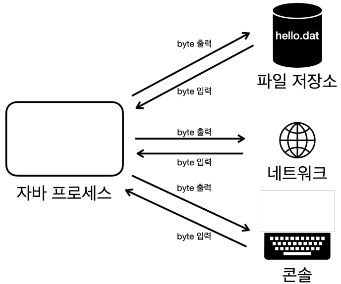
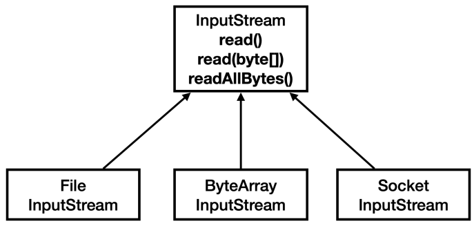
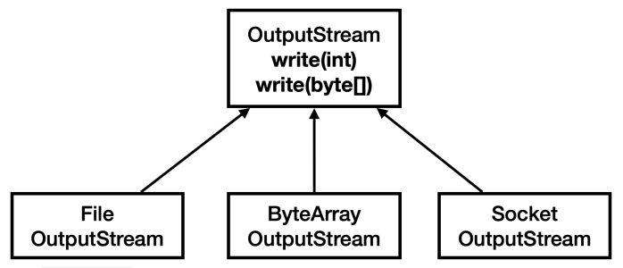

# Java 고급편 (2)

## 컴퓨터의 문자 인코딩(Charset Encoding)

<details>
   <summary> 정리 (📖 Click)</summary>
<br />

* 컴퓨터의 문자 인코딩

  * 문자 인코딩
    * 문자를 컴퓨터가 이해할 수 있는 숫자(byte)로 변경하는 것
  * UTF-8이 현대의 사실상 표준 인코딩 기술이 된 이유
    * 저장 공간 절약과 네트워크 효율성
    * ASCII와의 호환성
  * 결론
    * 사실상 표준인 UTF-8을 사용하자.
    * ASCII 영문 인코딩 : UTF-16을 제외하고 모두 호환

-----------------------
</details>

## 스트림(Stream)

<details>
   <summary> 정리 (📖 Click)</summary>
<br />

* 자바가 가진 데이터를 파일에 저장
  * 자바 프로세스가 가지고 있는 데이터를 밖으로 보내려면 출력 스트림을 사용
  * 반대로 외부 데이터를 자바 프로세스 안으로 가져오려면 입력 스트림을 사용
  * 각 스트림은 단방향으로 흐른다.

```java
package io;

import java.io.FileInputStream;
import java.io.FileOutputStream;
import java.io.IOException;

public class StreamStartMain1 {
    public static void main(String[] args) throws IOException {
        FileOutputStream fileOutputStream = new FileOutputStream("store/hello.dat");
        fileOutputStream.write(65);
        fileOutputStream.write(66);
        fileOutputStream.write(67);
        fileOutputStream.close();
      
        FileInputStream fileInputStream = new FileInputStream("store/hello.dat");
      
        int data;
        while ((data = fileInputStream.read()) != -1) {
          System.out.println(data);
      
        }
        fileInputStream.close();
    }
}
```

* `write()` : byte 단위로 값을 출력
* `read()` : 파일에서 데이터를 byte 단위로 하나씩 읽어온다.
  * 파일의 끝에 도달하게 되면 -1을 반환한다.
* `close()` : 파일에 접근하는 것은 자바 입장에서 외부 자원을 사용하는 것이다.
  *  자바에서 내부 객체는 사용되지 않으면 GC(가비지 컬렉터)가 되지만 외부 자원은 사용 후 반드시 닫아야 한다.
* `append()` : 기존 파일에 내용을 추가한다.

```java
package io;

import java.io.FileInputStream;
import java.io.FileOutputStream;
import java.io.IOException;
import java.util.Arrays;

public class StreamStartMain2 {
	public static void main(String[] args) throws IOException {
		FileOutputStream fileOutputStream = new FileOutputStream("store/hello.dat");
		byte[] input = {65, 66 ,67};
		fileOutputStream.write(input);
		fileOutputStream.close();

		FileInputStream fileInputStream = new FileInputStream("store/hello.dat");
		byte[] buffer = new byte[10];

		// 읽은 결과를 버퍼에 담아라.
		int readCount = fileInputStream.read(buffer);
		System.out.println("readCount = " + readCount);
		System.out.println(Arrays.toString(buffer));
		fileInputStream.close();
	}
}
```

```java
package io;

import java.io.FileInputStream;
import java.io.FileOutputStream;
import java.io.IOException;
import java.util.Arrays;

public class StreamStartMain3 {
	public static void main(String[] args) throws IOException {
		FileOutputStream fileOutputStream = new FileOutputStream("store/hello.dat");
		byte[] input = {65, 66 ,67};
		fileOutputStream.write(input);
		fileOutputStream.close();

		FileInputStream fileInputStream = new FileInputStream("store/hello.dat");

		// 모든 byte를 한 번에 읽기
		byte[] bytes = fileInputStream.readAllBytes();
		System.out.println(Arrays.toString(bytes));
		fileInputStream.close();
	}
}
```

* 부분으로 나누어 읽기 vs 전체 읽기
  * `read()`
    * 스트림의 내용을 부분적으로 읽거나 읽은 내용을 처리하면서 스트림을 계속해서 읽어야 할 경우에 적합하다.
    * 메모리 사용량을 제어할 수 있다.
    * 파일이나 스트림에서 일정한 크기의 데이터를 반복적으로 읽어야 할 때 유용하다.
  * `readAllBytes()`
    * 한 번의 호출로 모든 데이터를 읽을 수 있어 편리하다.
    * 작은 파일이나 메모리에 모든 내용을 올려서 처리해야 하는 경우에 적합하다.
    * 메모리 사용량을 제어할 수 없다.
    * 큰 파일의 경우 OutOfMemoryError 에러가 발생할 수 있다.

-----------------------
</details>

## InputStream, OutputStream

<details>
   <summary> 정리 (📖 Click)</summary>
<br />



* **데이터를 주고 받는 것 : I/O(Input/Output)**
* 자바 내부에 있는 데이터를 외부 파일에 저장하거나 네트워크를 통해 전송하거나 콘솔에 출력할 때 모두 byte 단위로 데이터를 주고 받는다.

* InputStream 추상 클래스



* OutputStream 추상 클래스



* 정리
  * InputStream과 OutputStream이 다양한 스트림들을 추상화하고 기본 기능에 대한 표준을 잡아둔 덕분에 편리한 입출력 작업이 가능해졌다.
    * 일관성 : 모든 종류의 입출력 작업에 대한 동일한 인터페이스를 사용할 수 있어 코드 일관성이 유지된다.
    * 유연성 : 실제 데이터 소스나 목적지가 무엇인지에 관계없이 동일한 방식으로 작성할 수 있다.
    * 확장성 : 새로운 유형의 입출력 스트림을 쉽게 추가할 수 있다.
    * 재사용성 : 다양한 스트림 클래스들을 조합하여 복잡한 스트림 입출력 작업을 수행할 수 있다.
    * 에러 처리 : 표준화된 예외 처리 메커니즘을 통해 일관된 방식으로 오류를 처리할 수 있다.

-----------------------
</details>

## 파일 입출력과 성능 최적화

<details>
   <summary> 정리 (📖 Click)</summary>
<br />

### 1. 1byte씩 데이터를 하나씩 전달하는 경우

```java
package io;

import java.io.FileOutputStream;
import java.io.IOException;

import static io.BufferedConst.*;

public class CreateFileV1 {
	public static void main(String[] args) throws IOException {
		FileOutputStream fileOutputStream = new FileOutputStream(FILE_NAME);
		long startTime = System.currentTimeMillis();

		for (int i = 0; i < FILE_SIZE; i++) {
			fileOutputStream.write(1);
		}
		fileOutputStream.close();

		long endTime = System.currentTimeMillis();
		System.out.println("파일 생성 소요 시간: " + (endTime - startTime) + "ms");
	}
}
```

실행 결과

```text
파일 생성 소요 시간: 42982ms
```

```java
package io;

import java.io.FileInputStream;
import java.io.IOException;

import static io.BufferedConst.FILE_NAME;

public class ReadFileV1 {
	public static void main(String[] args) throws IOException {
		FileInputStream fileInputStream = new FileInputStream(FILE_NAME);

		long startTime = System.currentTimeMillis();

		int fileSize = 0;
		int data;
		while ((data = fileInputStream.read()) != -1) {
			fileSize++;
		}
		fileInputStream.close();

		long endTime = System.currentTimeMillis();
		System.out.println("파일 읽기 소요 시간: " + (endTime - startTime) + "ms");
	}
}
```

```text
파일 읽기 소요 시간: 25995ms
```

* `write()`나 `read()`를 호출할 때마다 OS의 시스템 콜을 통해 파일을 읽거나 쓰는 명령어를 전달한다.
* 이러한 시스템 콜은 상대적으로 무거운 작업이다.
* HDD, SDD 같은 장치들도 하나의 데이터를 읽고 쓸 때마다 필요한 시간이 있다. HDD의 경우 더욱 느린데, 물리적으로 디스크의 회전이 필요하다.
* 시스템 콜 자체가 상당한 오버헤드를 유발한다. 따라서 최적화를 위해선 호출 횟수를 줄여 시스템 콜 횟수를 줄여야 한다.

### 2. byte[]를 통해 버퍼에 담아서 한 번에 여러 byte를 전달

```java
package io;

import java.io.FileOutputStream;
import java.io.IOException;

import static io.BufferedConst.*;

public class CreateFileV2 {
	public static void main(String[] args) throws IOException {
		FileOutputStream fileOutputStream = new FileOutputStream(FILE_NAME);
		long startTime = System.currentTimeMillis();

		byte[] buffer = new byte[BUFFER_SIZE];
		int bufferIndex = 0;

		for (int i = 0; i < FILE_SIZE; i++) {
			buffer[bufferIndex++] = 1;

			// 버퍼가 가득 차면 버퍼를 비우기
			if (bufferIndex == BUFFER_SIZE) {
				fileOutputStream.write(buffer);
				bufferIndex = 0;
			}
		}

		// 버퍼가 가득 차지 않은 상태인 경우
		if (bufferIndex > 0) {
			fileOutputStream.write(buffer, 0, bufferIndex);
		}
		fileOutputStream.close();

		long endTime = System.currentTimeMillis();
		System.out.println("파일 생성 소요 시간: " + (endTime - startTime) + "ms");
	}
}
```

실행 결과

```text
파일 생성 소요 시간: 41ms
```

* 많은 데이터를 한 번에 전달하면 성능 최적화를 할 수 있다.
* 많은 데이터를 전달하기 위해 버퍼를 사용한다.
* 이 때, 버퍼의 크기가 크다고 해서 이에 비례하여 성능이 개선되는 것은 아니다.
* 버퍼의 크기는 보통 4KB, 8KB 정도로 잡는 것이 효율적이다.

```java
package io;

import java.io.FileInputStream;
import java.io.IOException;

import static io.BufferedConst.BUFFER_SIZE;
import static io.BufferedConst.FILE_NAME;

public class ReadFileV2 {
	public static void main(String[] args) throws IOException {
		FileInputStream fileInputStream = new FileInputStream(FILE_NAME);

		long startTime = System.currentTimeMillis();

		byte[] buffer = new byte[BUFFER_SIZE];
		int fileSize = 0;
		int data;

		while ((data = fileInputStream.read(buffer)) != -1) {
			fileSize++;
		}
		fileInputStream.close();

		long endTime = System.currentTimeMillis();
		System.out.println("파일 읽기 소요 시간: " + (endTime - startTime) + "ms");
	}
}
```

실행 결과

```text
파일 읽기 소요 시간: 8ms
```

* 버퍼를 사용한 결과 성능 향상을 볼 수 있었다.
* 하지만 직접 버퍼를 만들고 관리해야 한다는 번거로움이 있다.

### 3. Buffered 스트림 쓰기

```java
package io;

import java.io.BufferedOutputStream;
import java.io.FileOutputStream;
import java.io.IOException;

import static io.BufferedConst.*;

public class CreateFileV3 {
  public static void main(String[] args) throws IOException {
    FileOutputStream fileOutputStream = new FileOutputStream(FILE_NAME);
    BufferedOutputStream bufferedOutputStream = new BufferedOutputStream(fileOutputStream, BUFFER_SIZE);
    long startTime = System.currentTimeMillis();

    for (int i = 0; i < FILE_SIZE; i++) {
      bufferedOutputStream.write(1);
    }
    fileOutputStream.close();

    long endTime = System.currentTimeMillis();
    System.out.println("파일 생성 소요 시간: " + (endTime - startTime) + "ms");
  }
}
```

실행 결과

```text
파일 생성 소요 시간: 315ms
```

* BufferedOutputStream은 버퍼 기능을 제공하는 보조 스트림이다.
* 버퍼의 크기만큼 데이터를 모아서 전달하기 때문에 빠른 속도로 데이터를 처리할 수 있다.

### 4. Buffered 스트림 읽기

```java
package io;

import java.io.BufferedInputStream;
import java.io.FileInputStream;
import java.io.IOException;

import static io.BufferedConst.BUFFER_SIZE;
import static io.BufferedConst.FILE_NAME;

public class ReadFileV3 {
	public static void main(String[] args) throws IOException {
		FileInputStream fis = new FileInputStream(FILE_NAME);
		BufferedInputStream bis = new BufferedInputStream(fis, BUFFER_SIZE);
		long startTime = System.currentTimeMillis();

		int fileSize = 0;
		int data;
		while ((data = bis.read()) != -1) {
			fileSize++;
		}
		bis.close();

		long endTime = System.currentTimeMillis();
		System.out.println("파일 읽기 소요 시간: " + (endTime - startTime) + "ms");
	}
}
```

실행 결과

```text
파일 읽기 소요 시간: 286ms
```

* 버퍼를 직접 다루는 것 vs BufferedXXX
  * 버퍼를 직접 다루는 것이 더 빠르다.
  * 그 이유는 바로 동기화 때문이다.
  * BufferedXXX 클래스 내부를 보면 락이 포함되는 것을 볼 수 있는데 이는 싱글 쓰레드보다 멀티 쓰레드 환경에 더 적합하다.
  * 싱글 쓰레드 상황에서는 동기화 락이 필요하지 않기 때문에 직접 버퍼를 다룰 때와 비교해서 성능이 떨어지는 것이다.

### 5. 한 번에 쓰기

* 전제 조건 : 메모리를 한 번에 많이 사용하므로 파일의 크기가 작아야 한다.

```java
package io;

import java.io.FileOutputStream;
import java.io.IOException;

import static io.BufferedConst.*;

public class CreateFileV4 {
	public static void main(String[] args) throws IOException {
		FileOutputStream fileOutputStream = new FileOutputStream(FILE_NAME);
		long startTime = System.currentTimeMillis();

		byte[] buffer = new byte[FILE_SIZE];
		for (int i = 0; i < FILE_SIZE; i++) {
			buffer[i] = 1;
		}
		fileOutputStream.write(buffer);	// 한 번에 쓰기
		fileOutputStream.close();

		long endTime = System.currentTimeMillis();
		System.out.println("파일 생성 소요 시간: " + (endTime - startTime) + "ms");
	}
}
```

```java
package io;

import java.io.FileInputStream;
import java.io.IOException;

import static io.BufferedConst.FILE_NAME;

public class ReadFileV4 {
	public static void main(String[] args) throws IOException {
		FileInputStream fis = new FileInputStream(FILE_NAME);
		long startTime = System.currentTimeMillis();

		byte[] bytes = fis.readAllBytes();
		fis.close();

		long endTime = System.currentTimeMillis();
		System.out.println("파일 읽기 소요 시간: " + (endTime - startTime) + "ms");
	}
}
```

-----------------------
</details>

## I/O

<details>
   <summary> 정리 (📖 Click)</summary>
<br />

* **스트림의 모든 데이터는 `byte` 단위를 사용한다.** 따라서 `byte`가 아닌 문자를 스트림에 직접 전달할 수 없다.
* String 문자를 스트림을 통해 파일에 저장하려면 `byte`로 변환한 다음에 작성해야 한다.

```java
import java.io.FileInputStream;
import java.io.FileOutputStream;
import java.io.IOException;
import java.nio.charset.StandardCharsets;
import java.util.Arrays;

public class ReaderWriterMainV1 {
	public static void main(String[] args) throws IOException {
		String writeString = "ABC";

		byte[] bytes = writeString.getBytes(StandardCharsets.UTF_8);
		System.out.println("write String: " + writeString);
		System.out.println("write bytes: " + Arrays.toString(bytes));

		// 파일에 쓰기
		FileOutputStream fileOutputStream = new FileOutputStream(TextConst.FILE_NAME);
		fileOutputStream.write(bytes);
		fileOutputStream.close();

		// 파일로부터 읽기
		FileInputStream fileInputStream = new FileInputStream(TextConst.FILE_NAME);
		byte[] readAllBytes = fileInputStream.readAllBytes();
		System.out.println("read bytes: " + Arrays.toString(readAllBytes));
		fileInputStream.close();

		// byte[] → String 디코딩
		String s = new String(readAllBytes, StandardCharsets.UTF_8);
		System.out.println("read String: " + s);
	}
}
```

```java
import java.io.*;
import java.nio.charset.StandardCharsets;

public class ReaderWriterMainV2 {
	public static void main(String[] args) throws IOException {
		String writeString = "ABC";
		System.out.println("write String = " + writeString);
		
		// 파일에 쓰기
		FileOutputStream fileOutputStream = new FileOutputStream(TextConst.FILE_NAME);
		OutputStreamWriter outputStreamWriter = new OutputStreamWriter(fileOutputStream, StandardCharsets.UTF_8);
		outputStreamWriter.write(writeString);
		outputStreamWriter.close();
		
		// 파일로부터 읽기
		FileInputStream fileInputStream = new FileInputStream(TextConst.FILE_NAME);
		InputStreamReader inputStreamReader = new InputStreamReader(fileInputStream, StandardCharsets.UTF_8);

		StringBuilder stringBuilder = new StringBuilder();
		int data;
		while ((data = inputStreamReader.read()) != -1) {
			stringBuilder.append((char) data);
		}
		inputStreamReader.close();
		System.out.println("read String = " + stringBuilder);
	}
}
```

* Reader, Writer 클래스를 사용하면 문자를 직접 스트림에 전달하는 것처럼 보이지만 사실은 그렇지 않다.
* 스트림에 전달할 때, 내부적으로 String → byte로 변환하는 과정을 거친다.

```java
import java.io.*;
import java.nio.charset.StandardCharsets;

public class BufferedWriterMain {

	private static final int BUFFER_SIZE = 8192;

	public static void main(String[] args) throws IOException {
		String writeString = "ABC";

		// 파일에 쓰기
		FileWriter fileWriter = new FileWriter(TextConst.FILE_NAME, StandardCharsets.UTF_8);
		BufferedWriter bufferedWriter = new BufferedWriter(fileWriter, BUFFER_SIZE);
		bufferedWriter.write(writeString);
		bufferedWriter.close();
		
		// 파일로부터 읽기
		StringBuilder stringBuilder = new StringBuilder();
		FileReader fileReader = new FileReader(TextConst.FILE_NAME, StandardCharsets.UTF_8);
		BufferedReader reader = new BufferedReader(fileReader, BUFFER_SIZE);

		String line;
		while ((line = reader.readLine()) != null) {
			stringBuilder.append(line);
		}
		reader.close();
		System.out.println(stringBuilder);
	}
}
```

-----------------------
</details>

## 객체 직렬화

<details>
   <summary> 정리 (📖 Click)</summary>
<br />

* 자바 객체 직렬화(Serialization)
  * 메모리에 있는 객체 인스턴스를 바이트 스트림으로 변환하여 파일에 저장하거나 네트워크를 통해 전송할 수 있도록 하는 기능
  * 이 과정에서 객체 상태를 유지하여 나중에 역직렬화(DeSerialization)를 통해 원래의 객체로 복원할 수 있도록 한다.
  * 객체 직렬화를 사용하려면 직렬화하려는 클래스는 반드시 `Serializable` 인터페이스를 구현해야 한다.
  * `Serializable` 인터페이스는 아무런 메서드가 없다. 단지 직렬화 가능한 클래스라는 것을 표시하기 위한 마커 인터페이스이다.

```java
// See also : ObjectOutputStream, ObjectInputStream
public interface Serializable {

}
```

* 객체 직렬화 덕분에 객체를 매우 편리하게 저장하고 불러올 수 있게 되었다.
* 객체 직렬화를 사용하면 객체를 바이트로 변환할 수 있어 모든 종류의 스트림에 전달할 수 있다.
* 이는 파일에 저장하는 것은 물론, 네트워크를 통해 객체를 전송하는 것도 가능하게 한다.
* 하지만 현대에 들어서 객체 직렬화는 잘 사용되지 않는다.

-----------------------
</details>

## 객체 직렬화의 한계점과 그 대안 - XML, JSON, 데이터베이스 

<details>
   <summary> 정리 (📖 Click)</summary>
<br />

* 객체 직렬화의 한계  
  * 버전 관리 어려움
    * 클래스 구조가 변경되면 이전에 직렬화된 객체와의 호환성 문제가 발생한다.
    * serialVersionUID 관리가 복잡하다.
  * 플랫폼 종속성
    * 자바 직렬화는 자바 플랫폼에 종속적이어서 다른 언어나 시스템과의 상호 운용성이 떨어진다.
  * 성능 이유
    * 직렬화/역직렬화 과정이 상대적으로 느리고 리소스를 많이 사용한다.
  * 유연성 부족
    * 직렬화된 형식을 커스터마이즈 하기 어렵다.
  * 크기 효율성
    * 직렬화된 데이터의 크기는 상당히 커질 수 있다.

▶ 객체 직렬화 대안 정리

* 나열했듯이 XML, JSON, 데이터베이스 여러 방법이 있으나 JSON을 먼저 고려하도록 하자.
* 성능 최적화가 매우 중요하다면 Protobuf, Avro 같은 기술을 고려하자.

-----------------------
</details>

