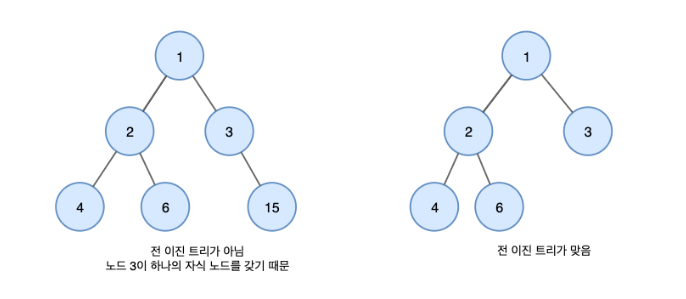

# Datastructure(자료구조)

## 1. Array vs LinkedList

   
 예비 답안 보기 (👈 Click)

 

-----------------------

* Array
  * Array 자료구조는 논리적 저장 순서와 물리적 저장 순서가 일치한다. 
  * 따라서 인덱스로 해당 원소에 접근할 수 있다. 
  * 그렇기 때문에 찾고자 하는 원소의 인덱스 값을 알고 있으면 O(1)에 해당 원소로 접근할 수 있다.
  * 하지만 삭제 또는 삽입 과정에서는 해당 원소에 접근하여 작업을 완료한 뒤, 추가 작업을 해줘야 한다.
  * 만약 배열의 원소 중 어느 원소를 삭제했다고 가정했을 때, 배열의 연속적인 특징이 깨지게 된다.
  * 빈 공간이 생기고 삭제한 원소보다 큰 인덱스를 갖는 원소들을 옮기는 비용이 발생하고 이 경우의 시간 복잡도는 O(N)이 된다.
  * 그렇기 때문에 Array 자료구조에서 삭제 기능에 대한 시간 복잡도는 O(N)이다. → 빅오 표기법은 최악의 시간을 기준으로 산정된다.
  * 삽입의 경우도 마찬가지다. 만약 첫 번째 자리에 새로운 원소를 추가하고자 한다면 모든 원소들의 인덱스를 1만큼 옮겨야 하므로 이 경우의 시간 복잡도 역시 O(N)이 된다.

* LinkedList
  * Array의 경우 삽입과 삭제 시 원소들을 옮겨야 한다는 문제가 발생한다.
  * 이 부분에 대한 문제점을 해결하기 위해 등장한 자료구조가 바로 LinkedList이다.
  * 각각의 원소들은 자기 자신 다음으로 어떤 원소인지만을 기억하고 있다.
  * 이 부분만 다른 값으로 바꿔주면 삭제와 삽입을 O(1) 만에 해결할 수 있다.
  * 하지만 LinkedList의 경우 원하는 위치에 삽입을 하고자 하려면 원하는 위치를 탐색하는 과정에 있어서 첫 번째 원소부터 확인해봐야 한다.
  * Array와는 달리 물리적 저장 순서와 논리적 저장 순서가 일치하지 않기 때문에 어떤 원소를 추가 혹은 삭제하고자 했을 때, 그 원소를 찾기 위해서 O(N)의 시간이 추가적으로 발생하게 된다.

-----------------------

## 2. Stack and Queue

   
 예비 답안 보기 (👈 Click)

 

-----------------------

* Stack
  * 선형 자료구조의 일종으로 LIFO(Last In First Out) 성격을 가진다.
  * LIFO란, 마지막에 들어간 원소가 첫 번째로 나온다는 것을 말한다.

* Queue
  * 선형 자료구조의 일종으로 FIFO(First In First Out) 성격을 가진다.
  * FIFO란, 먼저 들어간 원소가 먼저 나온다는 것을 말한다.

-----------------------

## 3. Tree

   
 예비 답안 보기 (👈 Click)

 

-----------------------

* 트리는 스택이나 큐와 같은 선형 구조가 아닌 비선형 자료구조이다.
* 트리는 계층적 관계(Hierarchical Relationship)를 표현하는 자료구조이다.
* 트리 관련 용어
  * 노드 : 트리를 구성하고 있는 각각의 요소를 의미한다.
  * 간선 : 트리를 구성하기 위해 노드와 노드를 연결하는 선을 의미한다.
  * 루트 노드 : 트리 구조에서 최상위에 있는 노드
  * 리프 노드 : 자식 노드가 없는 말단 노드
  * 내부 노드 : 리프 노드를 제외한 나머지 노드(루트 노드를 포함한다.)

-----------------------

## 4. Binary Tree

   
 예비 답안 보기 (👈 Click)

 

-----------------------
* 이진 트리
  * 루트 노드를 중심으로 두 개의 서브 트리로 나뉘어진다.
  * 또한 나뉘어진 두 서브 트리도 모두 이진트리여야 한다.
  * 모든 노드들이 둘 이하(0~2)의 자식을 가진 트리여야 한다.

* 포화 이진 트리
  * 모든 노드가 2개의 자식 노드를 가지며 모든 리프 노드가 동일한 레벨을 가진다.

* 완전 이진 트리
  * 마지막 레벨을 제외하고 모든 레벨이 왼쪽에서부터 완전히 채워져 있는 트리이다.

* 정 이진 트리
  * 모든 노드가 0개 또는 2개의 자식 노드를 갖는 트리이다.

* 편향 이진 트리
  * 모든 노드가 한 쪽 방향으로 쏠린 트리이다.

-----------------------

## 5. Binary Search Tree

   
 예비 답안 보기 (👈 Click)

 

-----------------------

* 이진 탐색 트리는 이진 트리의 일종이지만 데이터를 저장하는 규칙이 있다.
  * 규칙1) 이진 탐색 트리 노드에 저장된 키는 유일하다.
  * 규칙2) 부모 키가 왼쪽 자식 키보다 크다.
  * 규칙3) 부모 키가 오른쪽 자식 키보다 작다.
  * 규칙4) 왼쪽과 오른쪽 서브트리도 이진 탐색 트리이다.

* 이진 탐색 트리의 탐색 연산은 O(log N)의 시간 복잡도를 갖는다.
* 하지만 이런 이진 탐색 트리는 편향 이진 트리가 되어버리면 O(N)의 시간 복잡도를 갖게 된다.
* 배열보다 많은 메모리를 사용하며 데이터를 저장했지만 탐색에 필요한 시간 복잡도가 일반적인 배열에서의 탐색에서 발생하는 선형 시간 복잡도와 같게 되는 비효율적인 상황이 발생한다.
* 이러한 비효율적인 상황을 개선하기 위해 Rebalancing 기법이 등장하였다. 해당 기법은 균형을 잡기 위한 트리 구조의 재조정을 말한다.

-----------------------

## 6. Hash Table

   
 예비 답안 보기 (👈 Click)

 

-----------------------

* 해시는 내부적으로 배열을 사용하여 데이터를 저장하기 때문에 빠른 검색 속도를 갖는다.
* 키의 충돌을 방지하기 위해 해시함수를 이용하여 저장할 데이터와 연관된 고유한 숫자를 만들어 낸 뒤 이를 인덱스로 사용한다.
* 특정 데이터가 저장되는 인덱스는 그 데이터만의 고유한 위치이기 때문에 삽입 연산 시 다른 데이터 사이에 끼어들거나 삭제 시 다른 데이터로 채울 필요가 없으므로 연산에서 추가적인 비용이 발생하지 않는다.

-----------------------

## 7. Graph

   
 예비 답안 보기 (👈 Click)

 

-----------------------

* 정점과 간선으로 이루어져 있다. 
* 정점과 간선의 연결관계에 있어 방향성이 없는 그래프를 Undirected Graph라 한다.
* 정점과 간선의 연결관계에 있어 방향성이 있는 그래프를 Directed Graph라 한다,

* 그래프를 구현하는 방법
  * 인접 행렬 : 정방 행렬을 사용하는 방법
  * 인접 리스트 : 연결 리스트를 사용하는 방법

* 그래프 탐색
  * 깊이 우선 탐색(DFS)
    * 그래프 상에 존재하는 임의의 한 정점으로부터 나아간다.
    * 연결할 수 있는 정점이 있을 때까지 계속 연결하다가 더 이상 연결될 수 있는 정점이 없으면 바로 그 전 단계의 정점으로 돌아가 연결할 수 있는 정점이 있는지 살펴본다.
    * 이 때, Stack 자료구조를 사용한다.
  * 너비 우선 탐색(BFS)
    * 그래프 상에 존재하는 임으이의 한 정점으로부터 연결되어 있는 모든 정점으로 나아간다.
    * 탐색을 시작하는 정점을 Queue에 넣는다.
    * 그리고 Queue에서 dequeue를 사용하면서 dequeue된 정점과 간선으로 연결된 정점들을 enqueue한다.
    * 이 때, Queue 자료구조를 사용한다.

* 최소 스패닝 트리(MST)
  * 그래프를 구성하는 간선 중 간선의 합이 최소가 되게끔 하는 트리를 말한다.
  * 이 때, 사이클이 형성되면 안 된다.

* 크루스칼 알고리즘
  * 간선의 가중치를 오름차순으로 정렬하여 가중치가 제일 작은 간선부터 검토한다.
  * 이 때, 사이클이 형성되면 안 된다.

-----------------------

