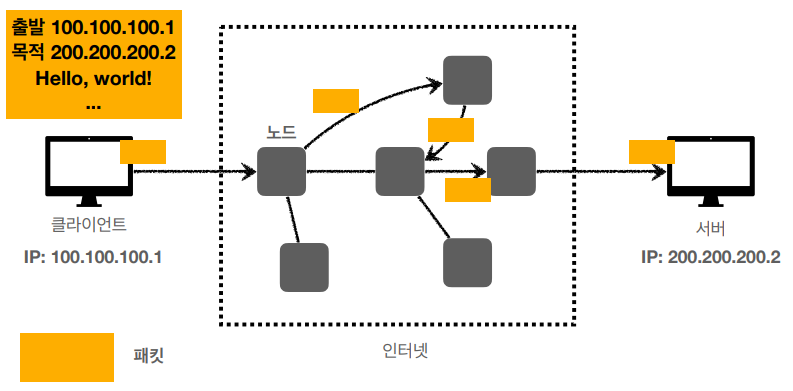
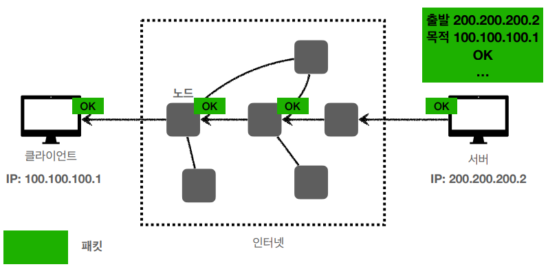
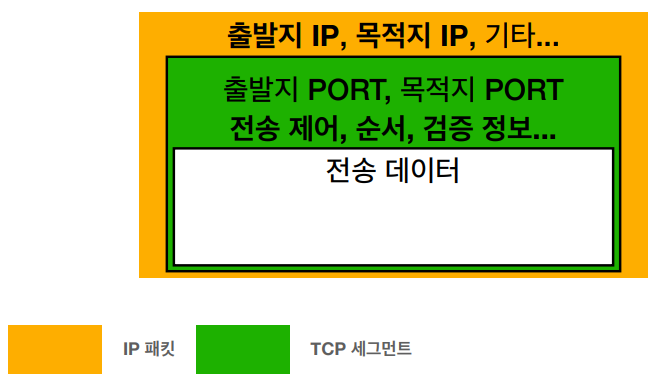
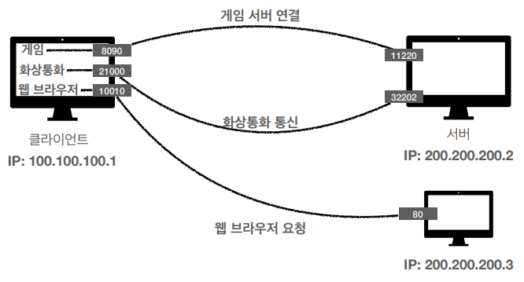

# HTTP

## 1. IP(Internet Protocol)

---

- 지정 주소로 데이터를 전달
- IP는 네트워크 계층에 해당, 패킷 단위로 데이터를 전달

**클라이언트에서 서버로 패킷을 전달하는 모습**

**서버에서 클라이언트로 패킷을 전달하는 모습**

- IP 프로토콜의 한계 : 비연결성, 비신뢰성
  - 비연결성 : 패킷을 받을 대상이 없거나 패킷을 받을 대상의 상태가 서비스 불능 상태여도 패킷을 전송
  - 비신뢰성 : 중간에 패킷이 유실될 가능성, 패킷이 전송한 순서대로 가지 않는 경우
  - 프로그램 구분 : 같은 IP를 사용하는 서버에서 통신하는 애플리케이션이 둘 이상인 경우(게임도 하면서 음악도 듣는...)

## 2. TCP, UDP

- TCP
  - 연결형 서비스를 지원하는 전송 계층 프로토콜
  - 속도보다는 신뢰성
  - HTTP 환경에서 기본으로 사용
  - TCP 3-way handshake(가상 연결 맺기) + 4-way handshake(가상 연결 끊기)
  - 흐름 제어, 혼잡 제어, 오류 제어를 통한 신뢰성 보장

- UDP
  - 비연결형 서비스를 지원하는 전송 계층 프로토콜
  - 신뢰성보다는 속도
  - 전송 순서 보장 X, 수신 여부 확인 X
  - 체크섬 필드를 통해 최소한의 오류만 검출

## 3. PORT

---

- Port
  - 네트워크를 통해 데이터를 주고 받는 프로세스를 식별하기 위해 호스트 내부적으로 프로세스가 할당받는 고유한 값
  - 하나의 IP 주소 내에서 프로그램(프로세스)을 구분하기 위한 것
  - 0 ~ 65535 할당 가능
  - 0 ~ 1023 : 잘 알려진 포트(Well known Port), 사용 권장 X

## 4. DNS

---

- DNS
  - 사용자 입장에서 기억하기 어려운 IP 주소를 문자로 표현한 주소로 바꾸는 시스템 혹은 서버

