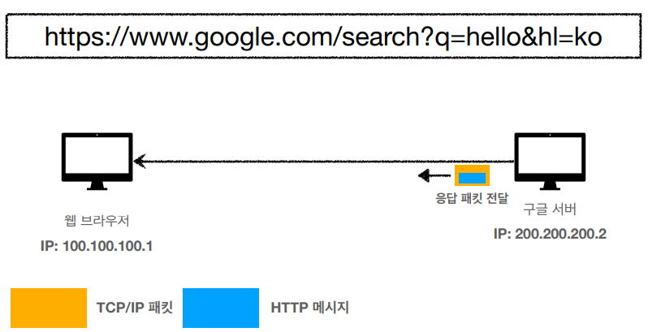
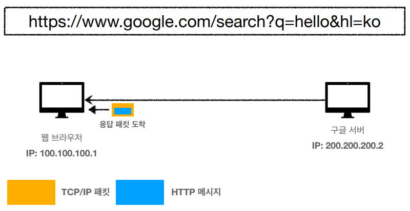
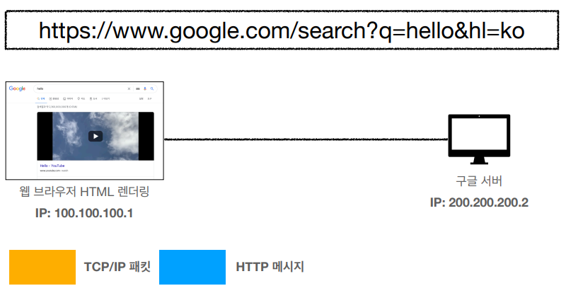

# HTTP

## 1. 웹 브라우저 요청 흐름

---

```textmate
웹 브라우저의 검색창에 www.google.com을 치고 접속할 경우 일어나는 일을 순차적으로 설명하시오.
```

1. `www.google.com`을 브라우저 주소창에 입력한다.
2. 브라우저는 캐싱된 DNS 기록을 통해 `www.google.com`에 대응되는 IP 주소가 있는지 확인한다.
   - DNS : IP 주소를 문자로 표현한 주소로 바꾸는 시스템 혹은 서버
3. 요청한 URL이 캐시에 없으면 ISP의 DNS 서버가 `www.google.com`을 호스팅하고 있는 서버의 IP 주소를 찾기 위해 DNS Query를 날려서 찾는다.
4. 브라우저는 IP 주소를 받아 서버와 TCP 연결을 한다.
   - SYN → ACK + SYN → ACK
5. TCP 가상 연결 설정이 완료되었다면 브라우저가 웹 서버에 HTTP 요청을 보낸다.
6. 서버는 요청을 처리하고 Response를 생성하고 보낸다.
7. 브라우저가 HTML Content를 사용자에게 보여준다.



- IP 패킷 정보 : 출발지 IP, 목적지 IP
- TCP 패킷 정보 : 출발지 Port, 목적지 Port, 전송 제어, 순서 등



