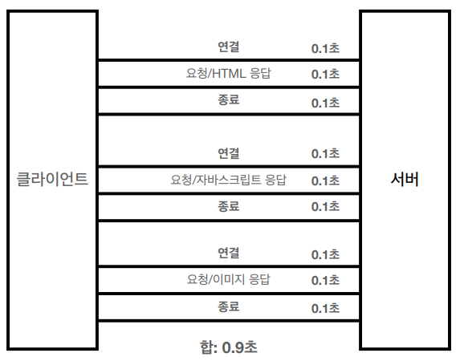
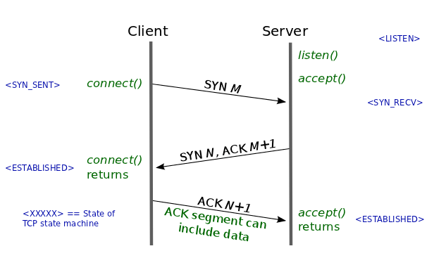

# HTTP

## 1. Stateless(무상태성) vs Stateful(상태유지)

---

- 무상태성(Stateless) : 클라이언트와 서버 사이의 상태를 유지하지 않는 것을 말한다.
- 서버 확장성 용이
- 클라이언트에서 서버로 데이터를 전송할 때 식별할 수 있는 것들을 포함해서 전송하므로 메모리를 많이 차지하게 된다.

- 클라이언트에서 서버 측에 요청을 보냈는데 서버 측에서 누가 요청을 보냈는지 알고 있는 경우 즉, 상태를 유지하는 설계에 해당한다.
- 하지만 서버에 장애가 발생하는 경우 클라이언트는 처음부터 작업을 다시 요청해야 한다.

- 서버가 클라이언트의 상태를 가지고 있지 않는다.
- 무상태성으로 설계하면 클라이언트가 상태 정보를 가지기 때문에 서버에 장애가 발생하더라도 처음부터 다시 작업을 요청할 필요가 없게 된다.
- 뿐만 아니라 무상태성으로 설계를 하게 되면 서버의 증설이 쉬워진다.
- 하지만 상태 유지보다 데이터를 많이 사용하게 된다는 단점이 있다.

## 2. Connectionless(비연결성)

---

- HTTP는 기본이 연결을 유지하지 않는 모델이다.
- 즉, 서버 - 클라이언트 간 연결을 지속하지 않는다.
- 연결을 계속 유지하게 되면 자원 낭비로 이어질 수 있다.
- 이런 비연결성 특성 덕분에 서버 자원을 효율적으로 사용할 수 있는 것이다.

- 비연결성 한계

  - 웹 브라우저로 사이트를 요청하면 HTML, CSS, JS 등 수많은 자원이 함께 다운로드 되는데 새로 연결을 맺을 때마다 TCP 3-way handshake 과정을 거치게 된다.

- 비연결성 극복

  - 클라이언트는 서버와 소켓 연결을 한 다음 필요한 자원을 요청/응답으로 다운로드 받는다.
  - 소켓 연결을 일정 시간 동안 더 유지함으로써 필요한 자원들을 모두 다운받을 때까지 연결이 종료되지 않고 요청/응답이 반복된 뒤 종료

## 3. TCP 3-way handshake & TCP 4-way handshake

---

1. 클라이언트는 서버에 접속을 요청하는 SYN을 보낸다.
2. 서버는 SYN 패킷을 받고 클라이언트에게 요청을 수락한다는 ACK와 SYN을 보낸다.
3. 클라이언트는 서버 수락 응답인 ACK와 SYN을 받고 ACK 패킷을 서버로 보내게 되면 논리적 연결이 성립된다.

1. 클라이언트가 연결을 종료하겠다는 FIN 플래그를 전송한다.
2. 서버는 클라이언트 요청을 받고 확인했다는 의미로 ACK를 클라이언트에게 보낸다.
3. 데이터를 모두 보낼 때까지 TIMEOUT 상태가 된다.
4. 데이터를 모두 보냈다면 연결이 종료되었다는 의미로 서버는 FIN 플래그를 클라이언트에게 보낸다.
5. 클라이언트는 FIN을 보고 확인했다는 의미로 ACK를 보낸다.
6. 클라이언트의 ACK 메시지를 받은 서버는 소켓 연결을 close한다.

→ TCP 연결 과정에서 3-way & 4-way로 차이가 나는 이유 : 클라이언트가 데이터 전송을 마쳤다고 하더라도 서버 측에서 보낼 데이터가 남았을 수 있기 때문에 ACK를 먼저 보내고 서버 측에서 보낼 나머지 데이터를 TIME_WAIT 시기 동안 전송한 후 FIN을 보내기 때문이다. 

