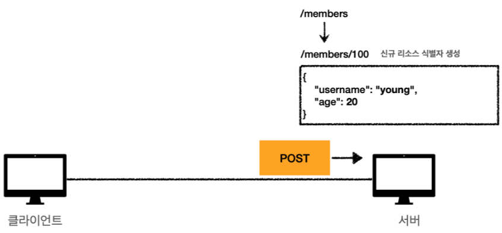

# HTTP 메서드

## 1. HTTP 메서드 - GET

---

- 리소스 조회 메서드
- [미네랄]을 캔다 → 여기서 `미네랄`이 리소스에 해당한다.
- 쿼리 파라미터 이외에 메시지 바디를 사용해서 데이터를 전달할 수 있으나 서버에서 따로 구성해야 되기 때문에 지원하지 않는 곳이 많아 해당 방법은 권장되지 않는다.
- 조회 시 POST도 사용할 수 있으나 GET은 캐싱이 가능하기에 GET을 사용하는 것이 유리하다.

**정적 데이터 조회 과정**

1. 이미지 / 정적 텍스트 문서 GET
2. 쿼리 파라미터 없이 리소스 경로만으로 단순하게 조회 가능

**동적 데이터 조회 과정**

1. 검색, 게시판 목록에서 검색어로 이용
2. 쿼리 파라미터를 사용해서 데이터를 전달
3. 쿼리 파라미터는 `?key1=value1&key2=value2` 형식으로 되어 있다.

**HTML Form을 통한 데이터 조회 과정**

1. HTML Form에 작성한 데이터를 서버에 전송하면서 서버와 통신
2. HTML Form은 GET, POST만 지원한다.

## 2. HTTP 메서드 - POST

---

- 전달한 데이터 처리/생성 요청 메서드
- 메시지 바디를 통해 서버로 요청 데이터를 전달하면 서버는 요청 데이터를 처리한다.
- 전달된 데이터로 주로 신규 리소스 등록, 프로세스 처리에 사용

**JSON 데이터 전송 과정(application/json)**

**HTML Form을 통한 데이터 전송 과정**

**multipart/form-data 데이터 전송 과정**

- Content-Type 헤더 종류

  - application/json : TEXT, XML, JSON 데이터 전송 시 사용
  - application/x-www-form-urlencoded : Form의 내용을 HTTP 메시지 바디를 통해 전송
  - multipart/form-data : 파일 업로드와 같은 바이너리 데이터 전송 시 사용

## 3. HTTP 메서드 - PUT

---

- 리소스를 대체하는 메서드(PATCH와 차이점이 있음)
- PUT을 사용하려면 리소스가 저장된 경로를 정확히 알고 있어야 한다.
- 만일 요청 메시지에 리소스가 있으면 완전히 대체하고 없다면 새로 생성하게 된다.
  - `/members/100` : 데이터가 존재하면 기존 데이터를 대체한다.
  - `/members/100` : 데이터가 없으면 대체할 것이 없으므로 새로 생성한다.

**PUT 요청에 리소스가 있는 경우**

**PUT 요청에 리소스가 없는 경우**

**PUT 요청에 일부 리소스만 변경하고자 하는 경우**

- 일부만 변경하더라도 기존 리소스가 완전히 대체되어 필드가 누락될 위험이 있다.
- 따라서 일부만 변경하는 경우에는 PUT 대신 PATCH 메서드를 사용해야 한다.

## 4. HTTP 메서드 - PATCH

---

- 리소스 일부만을 변경하는 메서드
- 만일 PATCH를 지원하지 않는 경우라면 POST를 사용할 수 있다.

## 5. HTTP 메서드 - DELETE

---

- 리소스를 제거하는 메서드

## 6. HTTP 메서드 속성

---

1. 안전성 : 보안 취약성이 아니라 메서드 호출 시 리소스가 변경되지 않는 성질을 말한다.

- GET의 경우 단순히 데이터를 조회하는 것이기에 리소스가 변경되지 않는다. 따라서 GET은 안전한 HTTP 메서드이다.
- POST, PUT, PATCH, DELETE의 경우 데이터의 변화를 주는 것이기에 안전하지 않은 HTTP 메서드이다.

2. 멱등성 : 수학이나 전산학에서 여러 번 적용하더라도 결과가 달라지지 않는 성질을 말한다.

**GET의 멱등성 : 데이터를 한 번 조회하든 여러 번 조회하든 같은 결과가 조회되므로 안전과 멱등을 동시에 만족한다.**

- 멱등적이지 않은 GET : 게시판 조회 수의 경우 조회를 하면 조회 수가 올라가게 되는데 이 때, 조회 수 컬럼의 값을 증가시키는 요청은 PATCH로 따로 분리하는 것이 옳다.
- A 사용자가 처음 리소스를 조회하고 B 사용자가 PUT 요청을 보내 리소스를 변경했다고 가정하자. 그 다음 A 사용자가 리소스를 조회하면 처음 조회했던 결과와 다른 결과가 호출된다.
- 그러면 GET이 멱등성을 보장할 수 없는 것 아니냐는 의문이 들 수 있으나 멱등성 여부는 **외부 요인으로 인해 리소스가 변경되는 것은 고려하지 않으며 서버 상태 기준으로 판단한다.**

---

**POST의 멱등성 : 서버로 데이터를 전송하여 새로운 리소스를 생성한다. 이 요청을 매번 보내게 되면 그에 따라 새로운 리소스가 생겨나므로 멱등을 만족하지 않는다.**

---

**PUT의 멱등성 : 대상 리소스가 있다면 대상 리소스를 완전히 대체하고 대상 리소스가 없다면 새로 추가한다.
처음 시도에서 대상 리소스 존재 유무에 따라 결과는 다르겠지만 그 이후에 계속 PUT 요청을 보내도 결과는 같으므로 멱등을 만족한다.**

- 리소스를 완전히 대체하고 난 후 계속 PUT 요청을 보내도 결과는 같다. 하지만 POST의 경우에는 매번 리소스가 생겨난다.
- PUT이 멱등을 만족하고 POST가 멱등을 만족하지 않는다는 것이 바로 이 차이점에서 비롯된다.

---

**PATCH의 멱등성 : PATCH의 경우 멱등을 보장할 수도 보장하지 않을 수도 있다.**

--- 

**DELETE의 멱등성 : DELETE를 처음 요청하면 리소스가 삭제된다. 허나 그 이후 계속 DELETE 요청을 보내도 결과는 변함이 없다.
따라서 멱등을 만족한다.**

3. 캐시 가능(Cacheable)

- 캐시 가능성이란 **응답 결과 리소스를 캐싱해서 사용이 가능한가**에 대한 것을 말한다.
- 스펙 상으론 GET, POST, PATCH 메서드가 캐시가 가능하나 실제론 GET이나 HEAD 정도만 캐시로 이용이 가능하다.