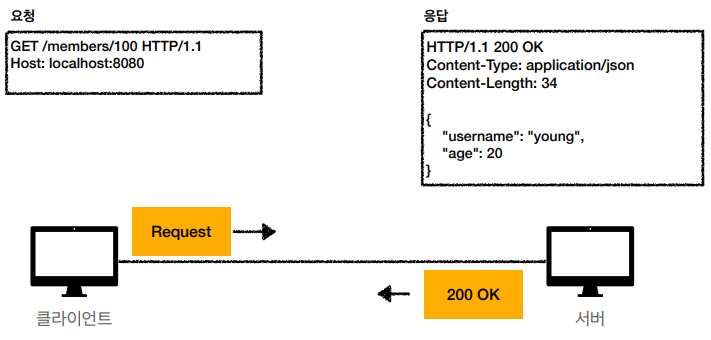
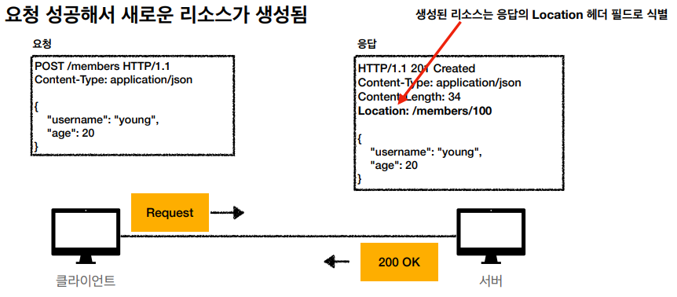
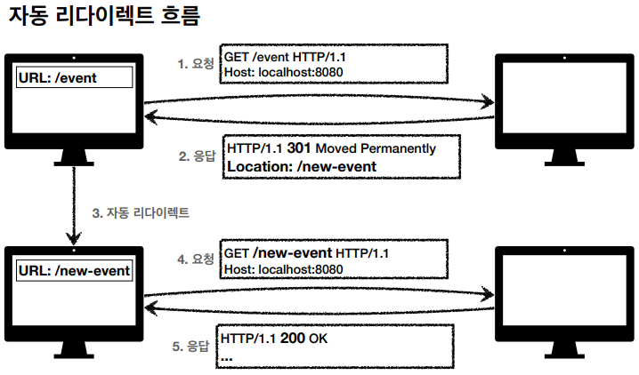
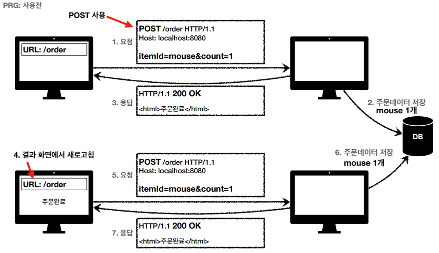
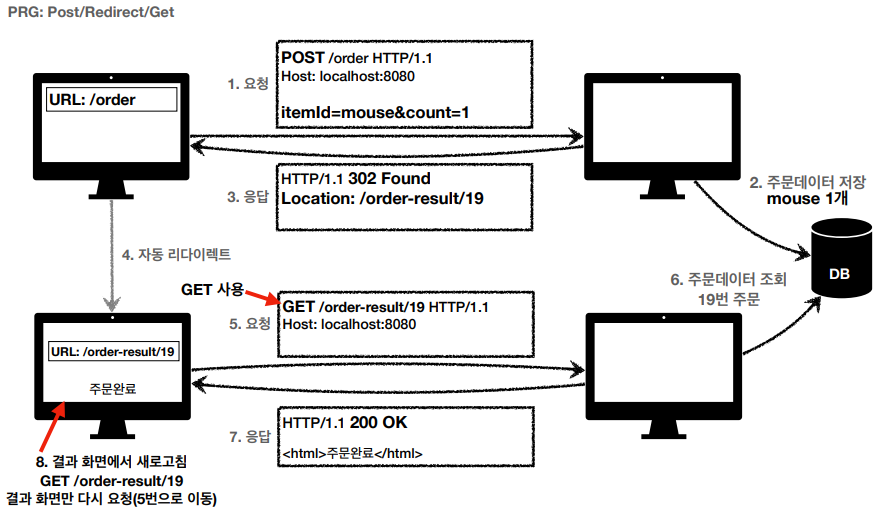

# HTTP 

## 1. HTTP Status Code(상태 코드)

---

- 상태 코드 : 클라이언트가 보낸 요청의 처리 상태를 응답에서 알려주는 기능

  - 1xx : 요청이 수신되어 처리 중
  - 2xx : 요청 정상 처리
  - 3xx : 요청을 완료하려면 추가 행동 필요
  - 4xx : 클라이언트 오류, 잘못된 문법 등으로 서버가 요청을 수행할 수 없음
  - 5xx : 서버 오류, 서버가 클라이언트의 정상 요청을 처리하지 못함

## 2. 2xx - 성공

---

- 200 OK

- 201 Created

- 202 Accepted : 요청이 접수되었으나 처리가 완료되지 않음
- 204 No Contented : 서버가 요청을 성공적으로 수행했지만 응답 페이로드 본문에 보낼 데이터가 없음

## 3. 3xx - 리다이렉션

---

- 웹 브라우저는 3xx 응답 결과에 Location 헤더가 있으면 Location 위치로 자동 이동

- 영구 리다이렉션

  - 리소스 URI가 영구적으로 이동
  - 원래 URL를 사용 X, 검색 엔진 등에서도 변경을 인지
  - 301 : 리다이렉트 요청 메서드가 GET으로 변하고 본문이 제거될 수 있음
  - 308 : 301과 기능은 같으나 리다이렉트 요청 메서드와 본문을 유지(처음 POST → 리다이렉트도 POST)

- 일시 리다이렉션

  - 리소스 URI가 일시적으로 이동
  - 302 : 리다이렉트 요청 메서드가 GET으로 변하고 본문이 제거될 수 있음
  - 307 : 리다이렉트 요청 메서드와 본문 유지
  - 303 : 리다이렉트 요청 메서드가 GET으로 변경

- PRG(Post / Redirect / Get)

  - 일시 리다이렉션 예시
  - Ex. 주문 접수 후 새로고침 시 주문이 중복될 수 있다.

- 문제 상황

- 해결 상황

- 기타 리다이렉션

  - 304 : 캐시 목적 사용, 클라이언트에게 리소스가 수정되지 않았음을 알려준다. 또한 304 응답은 응답에 메시지 바디를 포함해선 안 된다.

## 4. 4xx - 클라이언트 오류

---

- 클라이언트 요청에 잘못된 문법 등으로 서버가 요청을 받아들일 수 없음
- 오류의 원인이 클라이언트에 있음
- 400 : 클라이언트가 잘못된 요청을 해서 서버가 요청을 처리할 수 없음
- 401 : 클라이언트가 해당 리소스에 대한 인증이 필요함
- 403 : 서버가 요청을 이해했지만 승인을 거부함
- 404 : 요청한 리소스를 찾을 수 없음

## 5. 5xx - 서버 오류

---

- 서버 문제로 오류가 발생
- 503 : 서버가 일시적인 과부하 또는 예정된 작업으로 잠시 요청을 처리할 수 없음

#### 인증과 인가의 차이점 명확히 이해하기

- 인증(Authentication) : 유저가 누군지 확인하는 절차
- 인가(Authorization) : 유저에게 특정 권한을 부여하는 것

