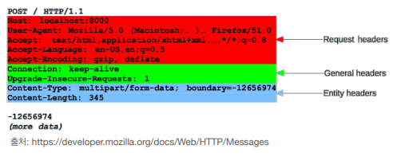
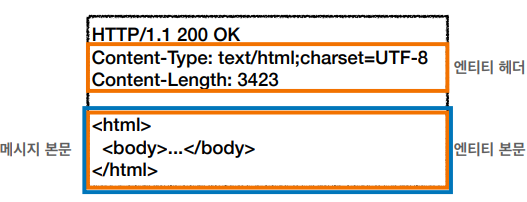
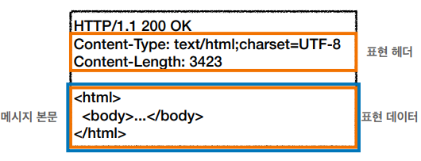
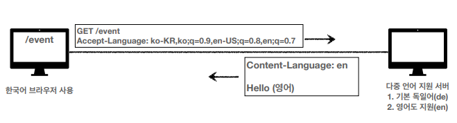
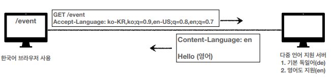
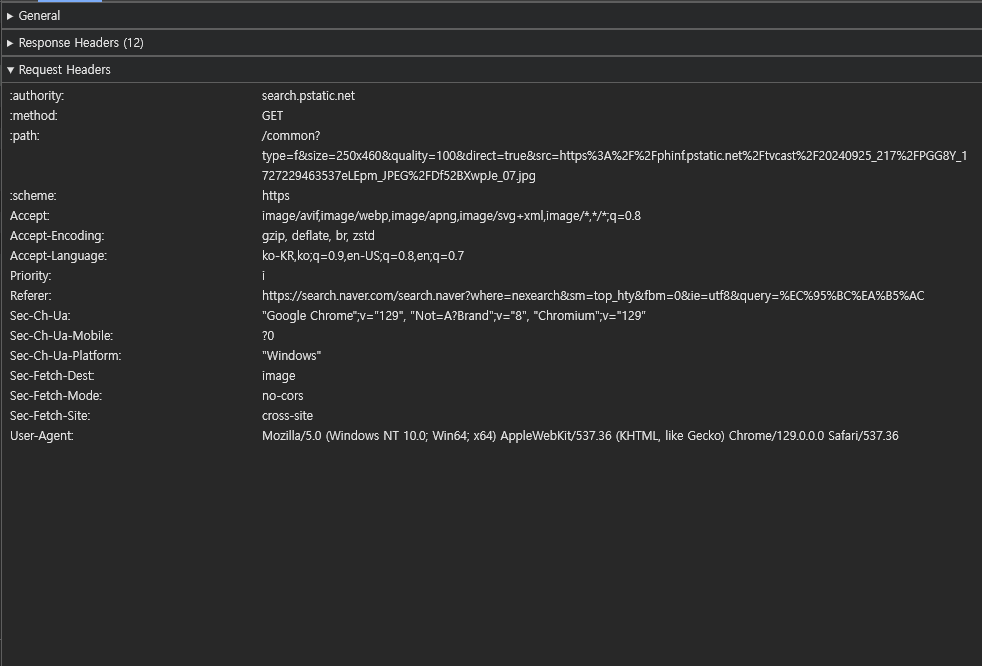
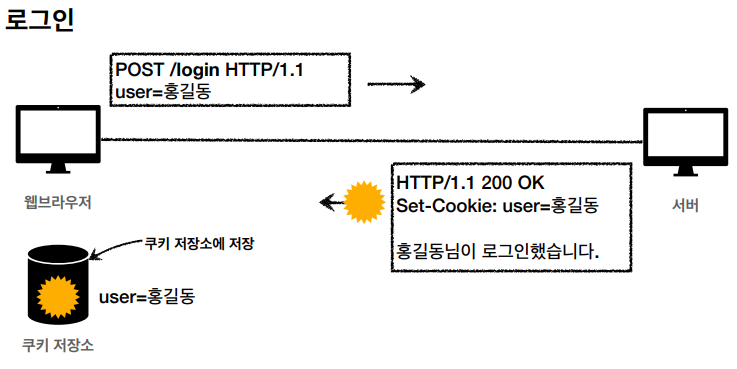
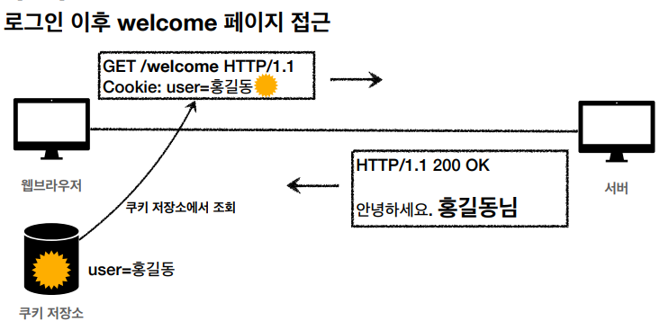
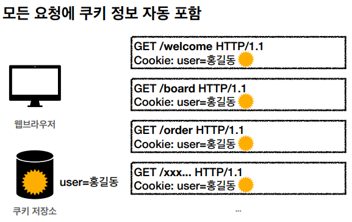

# HTTP 헤더1 - 일반 헤더

## 1. HTTP 헤더 및 바디 - RFC2616(과거)

---

- General 헤더 : 메시지 전체에 적용되는 정보
- Request 헤더 : 요청 정보
- Response 헤더 : 응답 정보
- Entity 헤더 : 엔티티 바디 정보

- 메시지 본문은 엔티티 본문을 전달하는데 사용
- 엔티티 본문은 요청이나 응답에서 전달할 실제 데이터
- 엔티티 헤더는 엔티티 본문의 데이터를 해석할 수 있는 정보 제공

  - 데이터 유형(HTML, Json), 데이터 길이, 압축 정보 등

## 2. HTTP 헤더 및 바디 - RFC7230(최신)

---

- 메시지 본문을 통해 표현 데이터를 전달
- 메시지 본문 = 페이로드(payload)
- 표현은 요청이나 응답에서 전달할 실제 데이터
- 표현 헤더는 표현 데이터를 해석할 수 있는 정보 제공

## 3. 표현

---

- Content-Type : 표현 데이터의 형식
- Content-Encoding : 표현 데이터 압축 방식
- Content-Language : 표현 데이터 자연 언어
- Content-Length : 표현 데이터 길이

## 4. 콘텐츠 협상

---

- Accept : 클라이언트가 선호하는 미디어 타입 전달
- Accept-Charset : 클라이언트가 선호하는 문자 인코딩
- Accept-Encoding : 클라이언트가 선호하는 압축 인코딩
- Accept-Language : 클라이언트가 선호하는 자연 언어

#### 협상과 우선순위(Quality Values)

- Quality Values(q) 값 사용
- 0 ~ 1 : 클수록 높은 우선순위
- 생략하면 1

- 구체적인 것이 우선

## 5. 전송 

---

- 단순 전송
- 압축 전송(용량 줄이기)
- 분할 전송
- 범위 전송

## 6. 일반 정보

- From : 유저 에이전트 이메일 정보
- Referer : 이전 웹 페이지 주소
- User-Agent : 유저 에이전트 애플리케이션 정보
- Server : 요청을 처리하는 오리진 서버 소프트웨어 정보
- Date : 메시지가 생성된 날짜

## 7. 특별한 정보

---

- Host : 요청한 호스트 정보(도메인)
- Location : 페이지 리다이렉션

  - 웹 브라우저는 3xx 응답 결과에 Location 헤더가 있으면 Location 위치로 자동 이동

- Allow : 허용 가능한 HTTP 메서드

  - 405 응답에 포함

- Retry-After : 유저 에이전트가 다음 요청을 하기까지 걸리는 시간

## 8. 인증

---

- Authorization : 클라이언트 인증 정보를 서버에 전달 → Basic xxxxxxxxxxxxx 형태
- WWW-Authenticate : 리소스 접근 시 필요한 인증 방법 정의 → 401 Unauthorized 응답과 함께 사용

## 9. 쿠키

---

- Set-Cookie : 서버에서 클라이언트로 쿠키를 만들어 응답
- Cookie : 클라이언트가 서버에서 받은 쿠키를 저장하고 이후 인증이 필요한 HTTP 요청 시 같이 전달

- 사용자가 로그인을 시도하면 서버에서 확인 후 쿠키를 만들어 클라이언트에게 응답으로 보낸다.
- 클라이언트는 서버로부터 전달받은 쿠키를 쿠키 저장소에 저장한다.

- 로그인 이후 인증을 필요로 하는 HTTP 요청 시 쿠키를 함께 보낸다.

- 모든 요청에 쿠키 정보를 자동으로 포함시킨다.
- 쿠키는 사용자 로그인 세션 관리, 광고 정보 트래킹 등에 사용된다.
- 쿠키 정보는 최소한의 정보만을 사용해야 한다.
- 보안에 민감한 데이터는 저장하면 안 된다.(주민등록번호, 신용카드 등)

#### 쿠키 - 생명주기

- Set-Cookie: expires=~

  - 만료일이 되면 쿠키 삭제

- Set-Cookie: max-age=~

  - 0이나 음수를 지정하면 쿠키 삭제

- 세션 쿠키 : 만료 날짜를 생략하면 브라우저 종료시까지
- 영속 쿠키 : 만료 날짜를 입력하면 해당 날짜까지

#### 쿠키 - 보안

- Secure : 쿠키는 http, https를 구분하지 않고 전송, Secure를 적용하면 https인 경우에만 전송
- HttpOnly : XSS 공격 방지, 자바스크립트에서 접근 불가, HTTP 전송 시에만 사용
- SameSite : XSRF 공격 방지, 요청 도메인과 쿠키에 설정된 도메인이 같은 경우에만 쿠키를 전송

