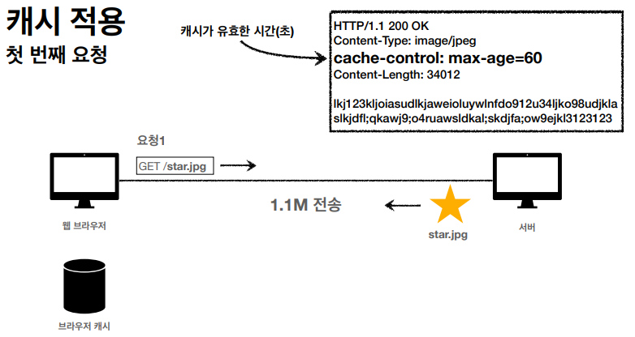
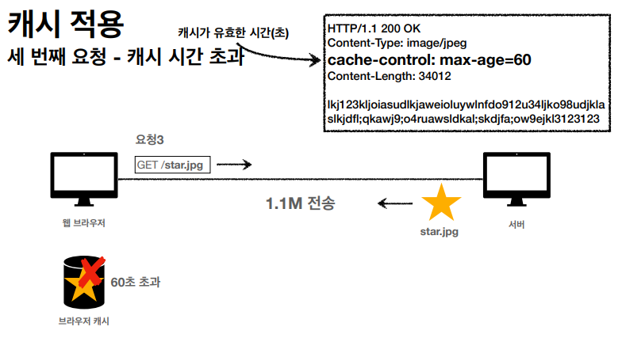

# HTTP 헤더2 - 캐시와 조건부 요청

## 1. 캐시 기본 동작

---

- 캐시가 없는 경우 데이터가 변경되지 않더라도 계속 네트워크를 통해서 데이터를 다운로드 받아야 한다.
- 네트워크 회선의 경우 느리고 비싸다.
- 브라우저 로딩 속도가 매번 느리다. 이로 인해 사용자 경험이 저해된다.

- 캐시가 있는 경우 캐시 가능 시간동안 네트워크를 사용하지 않아도 된다.
- 브라우저 로딩 속도가 매우 빨라진다. 이 캐시 덕분에 빠른 사용자 경험을 제공할 수 있게 된다.

- 캐시 가능 시간을 초과했다면 네트워크를 사용하여 다시 다운로드를 받고 받은 내용을 캐시에 저장하도록 한다.

## 2. 검증 헤더와 조건부 요청1

---

- 위의 캐시 가능 시간을 초과하는 경우 서버에 다시 요청을 하면 다음 두 가지 상황이 나타난다.

  - 서버에서 기존 데이터가 변경된 경우
  - 서버에서 기존 데이터가 변경되지 않은 경우

- 검증 헤더를 추가 → `Last-Modified`

- 위와 같이 마지막으로 수정된 시간을 헤더에 추가한다.

- 캐시 가능 시간을 초과했다면 헤더에 `Last-Modified`가 있는지 확인한다.
- 있다면 서버에 요청을 보낼 때, `if-modified-since` 헤더를 추가해 서버의 데이터가 변했는지를 체크한다.
- 데이터 최종 수정일을 비교해 만약 수정되지 않았다면(=데이터가 변하지 않았다면) 메시지 바디가 없는 상태의 304 상태 코드를 응답으로 보내주게 된다.
- 데이터가 변경되었다면 메시지 바디를 포함한 상태의 200 상태 코드를 응답으로 보내주게 된다.

## 3. 검증 헤더와 조건부 요청2

---

- `Last-Modified`, `if-modified-since`의 단점

  - 1초 미만(0.x초) 단위의 세밀한 캐시 조정 불가능
  - 날짜 기반 로직을 사용
  - 데이터를 수정해서 날짜가 다르지만 같은 데이터를 수정해서 데이터 결과가 똑같은 경우(Ex. A → B → A)
  - 서버에서 별도의 캐시 로직을 관리하고 싶은 경우(Ex. 스페이스 한 번 눌러도 수정된 것으로 간주되는 것을 방지)

- 대체 방안 → `ETag`, `if-none-match`

  - ETag(Entity Tag)
  - 캐시용 데이터에 임의의 고유한 버전 이름을 달아둠
  - 데이터가 변경되면 이 이름을 바꿔서 변경
  - ETag만 같으면 유지, 다르면 다시 받도록 하기

- 캐시 가능 시간을 초과했다면 서버 리소스의 ETag값과 클라이언트 캐시에 있는 ETag값을 비교한다.
- 진짜 단순하게 ETag값만 서버에 보내서 같으면 유지, 다르면 다시 받도록 한다.
- 캐시 제어 로직을 서버에서 완전히 관리한다.

## 4. 캐시와 조건부 요청 헤더

---

- Cache-Control : 캐시 제어

  - Cache-Control: max-age  → 캐시 유효 시간(초 단위)
  - Cache-Control: no-cache → 데이터는 캐시해도 되지만 항상 오리진 서버에 검증하고 사용
  - Cache-Control: no-store → 데이터에 민감한 정보가 있으므로 저장하면 안 됨
  - Cache-Control: must-revalidate → 캐시 만료 후 최초 조회시 오리진 서버에 검증, 오리진 서버 접근 실패 시 반드시 오류가 발생(504)
  - Cache-Control: public   → public 캐시에 저장
  - Cache-Control: private  → private 캐시에 저장
  - Cache-Control: s-maxage → 프록시 캐시에만 적용되는 max-age
  - Age: 60                 → 오리진 서버에서 응답 후 프록시 캐시 내에 머무는 시간(초 단위)

- Pragma : 캐시 제어
- Expires : 캐시 제어
- ETag 사용
  - If-Match
  - If-None-Match
- Last-Modified 사용
  - If-Modified-Since
  - If-Unmodified-Since

## 5. 프록시 캐시

---

- 프록시(Proxy) : 네트워크 통신에서 중개 역할을 하는 서버나 애플리케이션

- 오리진 서버에 직접 접근하는 것이 아닌 프록시 캐시 서버에 접근하도록 하여 속도를 개선할 수 있다.

## 6. 캐시 무효화

---

- no-cache : 304 Not Modified 응답
- 순간 네트워크 단절로 인해 오리진 서버에 접근할 수 없는 경우 차이점

  - no-cache: 200 응답 반환
  - must-revalidate: 504 응답 반환

