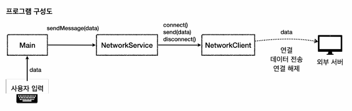
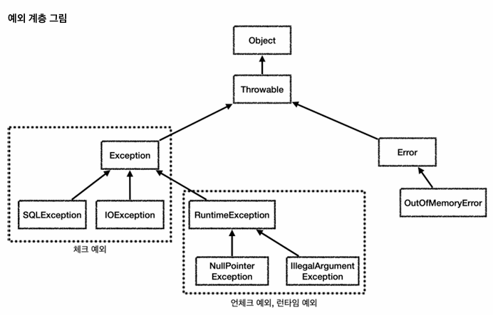
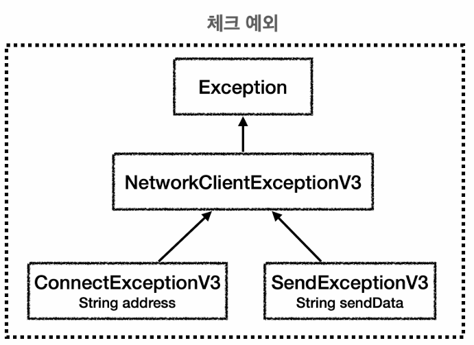
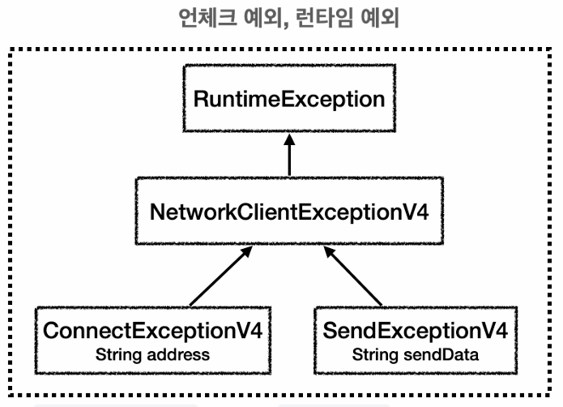

# 예외 처리

## 1. 프로그램 구성도

---

- 프로그램 구성도에 맞게 코드를 작성해보기



## 2. 예외 계층

---

- 예외 처리 관련 키워드 : `try`, `catch`, `finally`, `throw`, `throws`


 
- Object : 자바에서 예외도 객체이다. 모든 객체의 최상위 부모는 Object이다. 
- Throwable : 최상위 예외
- Error : 메모리 부족이나 심각한 시스템 오류와 같이 애플리케이션에서 복구가 불가능한 시스템 예외, 이 예외를 잡으려고 해선 안 된다. 
- Exception : 체크 예외, Exception과 그 하위 예외(단, RuntimeException 제외)는 컴파일러가 체크하는 예외
- RuntimeException : 언체크 예외, 런타임 예외

  - 런타임 즉, 애플리케이션 실행 중 발생하는 예외를 RuntimeException이라고 한다.

- 체크 예외의 경우 발생한 예외를 개발자가 직접 명시적으로 처리해야 한다.
- 언체크 예외의 경우 발생한 예외는 개발자가 직접 명시적으로 처리하지 않아도 된다.

## 3. 예외 처리 이해

---

- 예외가 터지면 자신을 호출한 곳으로 예외를 넘기게 된다.
- `main` 진입부에서 예외를 던지면 예외 로그를 출력하면서 시스템이 종료된다.
- `catch`는 예외를 잡는 것, `throws` 는 예외를 던지는 것이다.

## 4. 체크 예외

---

- `catch`는 해당 예외 타입과 그 하위 타입을 모두 잡을 수 있다.
- 하지만 실제 개발자가 직접 예외를 터뜨리고 잡는 과정까지 신경을 써야 하므로 많이 사용하는 것은 좋지 못하다.

```java
// 예시 코드

// Exception을 상속
public class MyCheckException extends Exception {
    public MyCheckException(String message) {
        super(message);
    }
}
```

```java
// 체크 예외를 던지는 코드

public class Client {
    public void call() throws MyCheckException {
        throw new MyCheckException("예외 터뜨려봄");
    }
}
```

```java
// 체크 예외를 잡는 코드

public class Service {

    Client client = new Client();

    // 서비스 측에서 예외 잡기
    public void callCatch() throws MyCheckException {
        try {
            client.call();
        } catch (MyCheckException e) {
            System.out.println("예외 해결 : " + e.getMessage());
        }
    }
}
```

## 5. 언체크 예외

---

- 언체크 예외는 체크 예외와 달리 예외를 잡지 않아도 된다.
- 이 때, 예외를 잡지 않으면 자동으로 예외를 던지게 되어 있다.
- 개발자가 누락할 가능성이 있으니 잘 체크해야 한다.

```java
// 예시 코드

// RuntimeException을 상속
public class MyUncheckedException extends RuntimeException {
    public MyUncheckedException(String message) {
        super(message);
    }
}
```

```java
// 언체크 예외를 던지는 코드(throws 생략)

public class Client {

    public void call() {
        throw new MyUncheckedException("RuntimeException");
    }
}
```

```java
// 언체크 예외를 잡는 코드

public class Service {

    Client client = new Client();

    public void callCatch() {
        try {
            client.call();
        } catch (MyUncheckedException e) {
            System.out.println("런타임 예외 잡기 : " + e.getMessage());
        }
    }
}
```

## 6. 예외 처리 도입 - 프로그램 구성도에 예외 처리를 도입

---

- 정상 흐름과 예외 흐름을 분리해서 코드를 읽기 쉽게 만든다.
- 사용한 자원을 항상 반환할 수 있도록 한다.

```java
// 예시 코드 - try ~ catch ~ finally

public class NetworkService {

    public void sendMessage(String data) {

        String address = "http://example.com";
        NetworkClient networkClient = new NetworkClient(address);
        networkClient.initError(data);

        try {
            networkClient.connect();
            networkClient.send(data);
        } catch (NetworkClientException e) {
            System.out.println("[오류] 코드 : " + e.getErrorCode() + ", 오류 메시지 : " + e.getMessage());
        } finally {
            networkClient.disconnect();
        }
    }
}
```

## 7. 예외 계층

---

- 단순히 오류 코드로 분류하는 것이 아니라 예외를 계층화하여 세분화시키면 더 정교한 예외 처리가 가능해진다.
- 앞서 배웠듯이 예외는 엄연한 객체다. 상속이 가능하다. 따라서 상속으로 예외를 계층화할 수 있다.
- `catch`로 예외를 세분화하여 처리할 때 순서대로 실행하므로 더 디테일한 예외를 먼저 잡아야 한다.




```java
// 예시 코드 - 세분화된 예외 객체 처리

public class NetworkService {

    public void sendMessage(String data) {

        String address = "http://example.com";
        NetworkClient networkClient = new NetworkClient(address);
        networkClient.initError(data);

        try {
            networkClient.connect();
            networkClient.send(data);
        } catch (ConnectException e) {
            System.out.println("[오류] 연결 오류 : " + e.getAddress() + ", 오류 메시지 : " + e.getMessage());
        } catch (NetworkClientException e) {
            System.out.println("[네트워크 오류] : " + e.getMessage());
        } catch (Exception e) {
            System.out.println("[알 수 없는 오류] : " + e.getMessage());
        } finally {
            networkClient.disconnect();
        }
    }
}
```

- 또한, 여러 예외를 잡기 위해 파이프(`|`) 기호를 사용할 수 있다.
- 단 이 방법의 경우 예외에 공통으로 존재하는 메서드만 호출이 가능하다.

```java
// 예시 코드 - 여러 예외를 한 번에 잡는 방법

public class NetworkService {

    public void sendMessage(String data) {

        String address = "http://example.com";
        NetworkClient networkClient = new NetworkClient(address);
        networkClient.initError(data);

        try {
            networkClient.connect();
            networkClient.send(data);
        } catch (ConnectException | SendException e) {
            System.out.println("[연결 오류 또는 전송 오류] 오류 : " + e.getMessage());
        }  finally {
            networkClient.disconnect();
        }
    }
}
```

## 8. 실무 예외 처리 방법

---

- 체크 예외를 남발하지 않도록 한다.
- 체크 예외를 해결한답시고 `throws Exception` 예외를 던지면 개발자가 직접 명시적으로 처리를 해야 한다.
- Exception은 최상위 예외 클래스이기에 `throws Exception`을 사용하게 되면 다른 체크 예외를 체크할 수 있는 기능이 무효화된다.
- Exception 자체를 던지는 것은 좋지 않은 방법이다.
- 외부 서버와의 연결, 데이터베이스와의 연결 등 복구할 수 없는 예외의 경우 일일이 처리할 수 없다.

→ 예외의 공통 처리

- 처리할 수 없는 예외들은 중간에서 나눠 처리하는 방법보다 공통으로 처리할 수 있는 곳을 하나 만들어서 한 곳에서 해결하면 좋다.

## 9. 실무 예외 처리 방법 예제

---



```java
// 예시 코드

package v5;

import java.util.Scanner;

public class Main {
  public static void main(String[] args) {
    Scanner scanner = new Scanner(System.in);
    NetworkService networkService = new NetworkService();

    while (true) {
      String input = scanner.nextLine();
      if (input.equals("exit")) {
        break;
      }

      try {
        networkService.sendMessage(input);
      } catch (Exception e) {
        // 예외를 한 곳에서 관리
        exceptionHandling(e);
      }
    }
    System.out.println("프로그램이 종료됩니다.");
  }

  // 공통 예외 처리(Exception은 최상위 예외)
  private static void exceptionHandling(Exception e) {
    System.out.println("예외 처리");
    System.out.println("개발자용 디버깅 메시지");
    e.printStackTrace(System.out);
  }
}
```

## 10. 기타 - try with resources(리소스 반환)

---

- `try with resources` : 자바 7에서 도입
- `try ~ catch ~ finally`과 비교했을 때 자원 반환 속도는 try with resources가 더 빠르다.
- try with resources를 사용하려면 `AutoCloseable` 인터페이스를 구현해야 한다.
- `try`가 끝나는 경우 `AutoCloseable` 인터페이스 메서드를 오버라이딩한 `close()` 메서드가 호출된다.

```java
// 예시 코드

public class NetworkService {

    public void sendMessage(String data) {

        String address = "http://example.com";

        try (NetworkClient networkClient = new NetworkClient(address)){
            networkClient.initError(data);
            networkClient.connect();
            networkClient.send(data);
        } catch (Exception e) {
            System.out.println("예외 확인 : " + e.getMessage());
            throw e;
        }
    }
}
```
