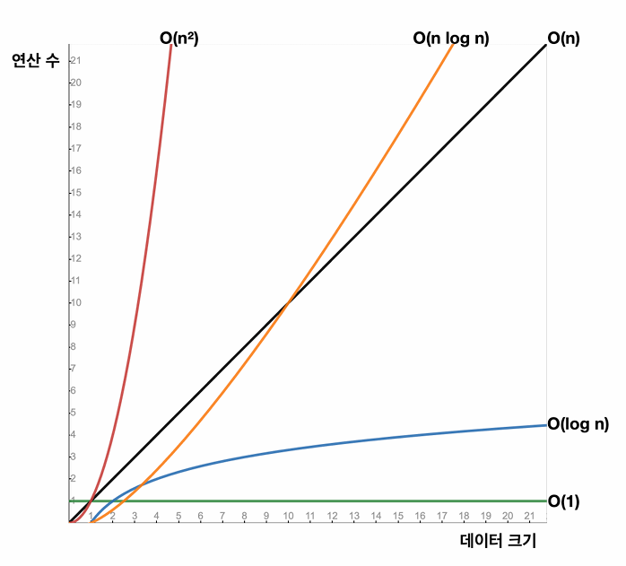

# 컬렉션 프레임워크 - ArrayList

## 0. 빅오 표기법(Big - O)

---

- 빅오 표기법이란 알고리즘 성능을 측정하기 위해 사용하는 수학적 방식이다.
- 정확한 실행 시간을 계산하는 것이 아니라 데이터 양에 따른 변화를 이해하는 것이 핵심이다.
- 빅오 표기법은 매우 큰 데이터를 입력한다는 것을 가정하며 이를 최악의 상황으로 간주한다.

(1). 상수 시간 - **O(1)**

- 입력 데이터 크기에 관계없이 항상 실행 시간이 일정하다.

(2). 선형 시간 - **O(N)**

- 실행 시간이 입력 데이터 크기에 대해 비례한다.
- 즉, 입력 데이터가 많으면 많을수록 실행 시간이 오래 걸리고 입력 데이터가 적으면 적을수록 실행 시간이 적게 걸린다.

(3). 제곱 시간 - **O(N^2)**

- 실행 시간이 입력 데이터 크기의 제곱에 대해 비례한다.

(4). 로그 시간 - **O(log N)**

- 실행 시간이 입력 데이터 크기의 로그에 대해 비례한다.

(5). 선형 로그 시간 - **O(N log N)**

## 1. 배열

--- 

- 배열 연산

  - 배열 검색
  - 인덱스를 통한 접근

- 인덱스를 통한 접근이라 함은 배열의 3번째 요소와 같이 특정 요소에 접근하는 경우를 말한다,
- 배열 검색이라 함은 배열에 들어있는 데이터를 찾는 것을 말한다. 이 때, 하나하나 비교를 해야 한다.
- 인덱스를 통한 접근의 경우 상수 시간이 소요되고 배열 검색의 경우 선형 시간이 소요된다.

## 2. 배열 연산 과정 및 특징 이해

---

- 배열의 한계

  - 배열은 가장 기본적인 자료구조, 인덱스를 사용할 때 최고의 효율을 낼 수 있다.
  - 배열은 선언과 동시에 크기가 정해진 정적 특성을 가지고 있어 동적으로 크기 조절이 불가능하다.
  - 동적으로 크기를 조절하고자 한다면 배열 복사를 활용해야 한다.
  - 그렇다고 배열을 처음 만들 때, 크기를 매우 크게 잡으면 메모리가 낭비되니 이 점도 고려해야 한다.

- 배열의 데이터 추가 케이스

  - 배열의 첫 번째 위치에 추가
  - 배열의 중간 위치에 추가
  - 배열의 마지막 위치에 추가

Ⅰ) 배열의 첫 번째 위치에 데이터를 추가

- 배열의 첫 번째 위치에 데이터를 추가하려면 첫 번째 위치에 있는 데이터들을 모두 오른쪽으로 한 칸씩 옮겨야 한다.
- 이 때, 주의할 점이 있다. 배열의 경우 선언 시 크기를 제한하기 때문에 만약 데이터의 갯수가 제한된 크기를 모두 채우게 된다면 배열 크기를 기존 배열의 크기를 2배 늘린 후 복사하여 새로 만든 배열에 넣어줘야 한다.
- 결과적으로 인덱스로 조회할 때 O(1), 그리고 데이터를 오른쪽으로 한 칸씩 옮길 때 O(N)이므로 O(N)의 시간 복잡도를 가진다.

Ⅱ) 배열의 중간 위치에 데이터를 추가

- 지정한 인덱스에 데이터를 추가할 위치를 확보해야 한다.
- 따라서, 지정된 인덱스를 포함한 이후의 데이터를 모두 오른쪽으로 한 칸씩 옮겨야 한다.
- 결과적으로 인덱스로 조회할 때 O(1), 그리고 데이터를 오른쪽으로 한 칸씩 옮길 때 O(N/2)이므로 O(N)의 시간 복잡도를 가진다.

Ⅲ) 배열의 마지막 위치에 데이터를 추가

- 배열의 마지막 위치에 데이터를 추가하는 경우 데이터의 이동이 필요하지 않다.
- 결과적으로 O(1)의 시간 복잡도를 가진다.
