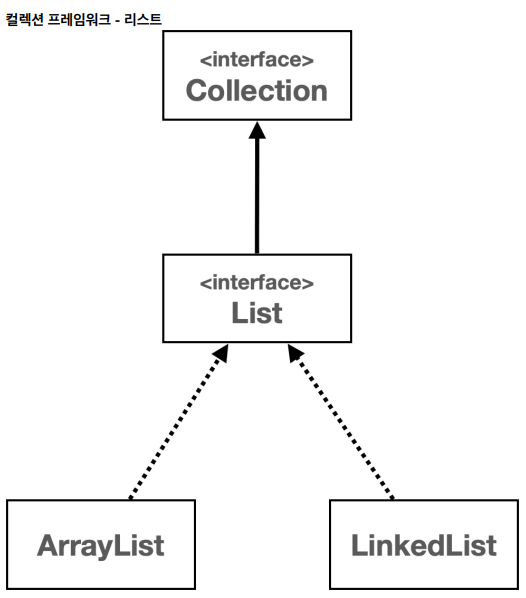

# 컬렉션 프레임워크 - List 인터페이스

## 1. List 자료 구조

---

- 순서가 있고, 중복을 허용하는 자료 구조

- ArrayList(List 인터페이스 구현체 클래스) : 배열 리스트
- LinkedList(List 인터페이스 구현체 클래스) : 연결 리스트
- 뒤에 추가하는 경우 배열 리스트
- 앞이나 중간에 추가하는 경우 연결 리스트

| 질문                                    | 답변                                                                    |
|---------------------------------------|-----------------------------------------------------------------------|
| List 인터페이스가 무엇인가요?                    | List는 자바 컬렉션 프레임웍의 일부로 순서가 있고 중복을 허용하며 인덱스를 통해 요소에 접근할 수 있는 자료 구조입니다. |
| List 인터페이스의 주요 구현 클래스에는 무엇이 있나요?      | ArrayList, LinkedList, Vector, Stack 등이 있습니다.                         |
| 주어진 경우에 대해 빅오 표기법을 사용해 시간 복잡도를 적어보세요. | 각 자료구조에 근거하여 설명                                                       |

※ 정리

- 추가 / 삭제 측면

  - 배열 리스트 - 인덱스 조회 O(1)
  - 배열 리스트 - 데이터 추가 O(N)
  - 연결 리스트 - 인덱스 조회 O(N)
  - 연결 리스트 - 데이터 추가 O(1)

- 앞에 추가 / 앞에 삭제

  - 배열 리스트 - 추가나 삭제할 위치 찾기 O(1)
  - 배열 리스트 - 추가나 삭제에 따른 다른 데이터 위치 이동 O(N)
  - 연결 리스트 - 추가나 삭제할 위치 찾기 O(1)
  - 연결 리스트 - 추가나 삭제에 따른 다른 데이터 위치 이동 O(1)

- 중간에 추가 / 중간에 삭제

  - 배열 리스트 - 추가나 삭제할 위치 찾기 O(1)
  - 배열 리스트 - 추가나 삭제에 따른 다른 데이터 위치 이동 O(N)
  - 연결 리스트 - 추가나 삭제할 위치 찾기 O(N)
  - 연결 리스트 - 추가나 삭제에 따른 다른 데이터 위치 이동 O(1)

- 뒤에 추가 / 뒤에 삭제

  - 배열 리스트 - 추가나 삭제할 위치 찾기 O(1)
  - 배열 리스트 - 추가나 삭제에 따른 다른 데이터 위치 이동 X
  - 연결 리스트 - 추가나 삭제할 위치 찾기 O(N)
  - 연결 리스트 - 추가나 삭제에 따른 다른 데이터 위치 이동 O(1)

- 인덱스 조회

  - 배열 리스트 - O(1)
  - 연결 리스트 - O(N)

- 검색(특정 데이터를 찾는 행위)

  - 배열 리스트 - O(N)
  - 연결 리스트 - O(N)