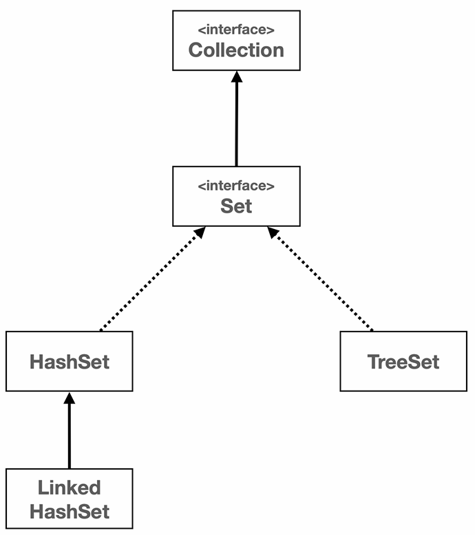
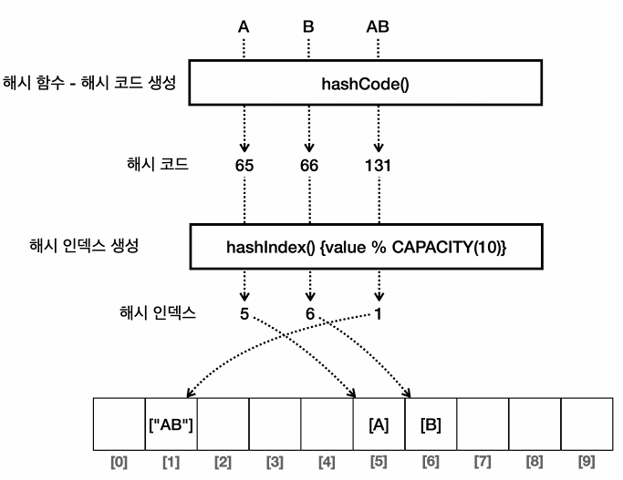

# 컬렉션 프레임워크 - 해시(Hash)

## 1. Set 특징

---

- Set은 중복된 요소가 존재하지 않는다.
- Set은 순서를 보장하지 않는다.
- Set은 빠른 검색이 가능하다.



## 2. 문자열 해시 코드

---

- 해시 함수 : 해시 함수는 임의의 길이의 데이터를 입력 받아 고정된 길이의 해시값(해시코드)을 출력하는 함수
- 같은 데이터를 입력하면 항상 같은 해시 코드가 출력된다.
- 다른 데이터를 입력해도 우연의 일치로 같은 해시 코드가 출력될 수 있는데 이를 해시 충돌이라고 한다.
- 해시 코드 : 데이터를 대표하는 값 → 해시 함수를 통해 만들어진다.
- 해시 인덱스 : 데이터의 저장 위치 결정 → 주로 해시 코드를 통해 만든다.



## 3. equals(), hashCode()의 중요성

---

- 해시 자료 구조 사용 & 해시 충돌 방지를 위해 `eqauls()`, `hashCode()` 메서드를 재정의해야 한다.

Ⅰ) `equals()` & `hashCode()` 메서드 둘 다 재정의하지 않은 경우

```java
// 예시 코드
// `==`의 경우 → 참조값을 기준으로 비교, 현재 두 인스턴스는 서로 다른 참조값을 가지므로 false
// `equals()`의 경우 기본적으로 참조값을 기준으로 비교, 따라서 false

public class Main {
  public static void main(String[] args) {
    Member m1 = new Member("id-100");
    Member m2 = new Member("id-100");

    System.out.println(m1 == m2);       // false
    System.out.println(m1.equals(m2));  // false
  }
}
```

Ⅱ) `equals()`는 구현하지 않고 `hashCode()`만 구현한 경우

```java
// 예시 코드
// equals() 메서드 재정의 : 객체 논리값 비교 → 따라서, true
// == 비교는 객체 참조값을 기준으로 비교 → 따라서, false

public class Main {
  public static void main(String[] args) {
    Member m1 = new Member("id-100");
    Member m2 = new Member("id-100");

    System.out.println(m1 == m2);       // false
    System.out.println(m1.equals(m2));  // true
  }
}
```

Ⅲ) `equals()` & `hashCode()` 둘 다 모두 재정의한 경우

```java
// 예시 코드

public class Main {
  public static void main(String[] args) {
    Member m1 = new Member("id-100");
    Member m2 = new Member("id-100");

    System.out.println(m1 == m2);       // false  
    System.out.println(m1.equals(m2));  // true
  }
}
```

- 무조건 `hashCode()`를 재정의해야 하는 것은 아니다.
- 해시 자료 구조를 사용해야 한다면 `hashCode()`와 `equals()`를 반드시 재정의해야 한다.
- 이 때, 직접 정의하면 실수가 있을 수 있으므로 IDE의 도움을 받으면 쉽게 재정의가 가능하다.

## 4. 자바가 제공하는 Set - HashSet

---

- 구현 : 해시 자료 구조
- 순서 : 특정한 순서 없이 저장
- 시간 복잡도 : O(1)
- 데이터 유일성이 중요, 순서는 중요하지 않은 경우에 적합
- 추가적으로 자바의 HashSet은 데이터의 양이 배열 크기의 75% 정도 넘어가면 배열 크기를 2배로 늘리고 2배 늘어난 크기를 기준으로 모든 요소에 해시 인덱스를 다시 적용한다.


## 5. 자바가 제공하는 Set - LinkedHashSet

---

- 구현 : HashSet + 연결 리스트
- 순서 : 요소들은 추가된 순서대로 순서를 유지
- 시간 복잡도 : O(1)
- 데이터 유일성도 중요하며 순서를 유지해야 하는 경우에 적합

## 6. 자바가 제공하는 Set - TreeSet

---

- 구현 : 이진 탐색 트리를 개선한 레드-블랙 트리를 내부에서 사용
- 순서 : 요소들은 정렬된 순서대로 저장
- 이진 탐색 트리의 최악의 경우는 바로 편향 이진 트리이다.
- 편향 이진 트리의 경우 한 방향으로만 나열되어 있어 시간 복잡도를 표기하면 O(N)이 된다.
- 위 문제를 해결하기 위해 균형이 너무 깨졌다고 판단되면 동적으로 균형을 다시 맞추게 된다.
- 시간 복잡도 : O(log N)
- 데이터가 정렬된 순서를 유지하면서 집합 특성 역시 유지해야 할 때 사용한다.