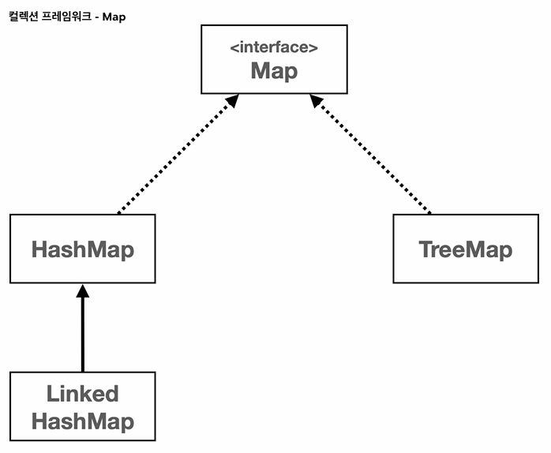
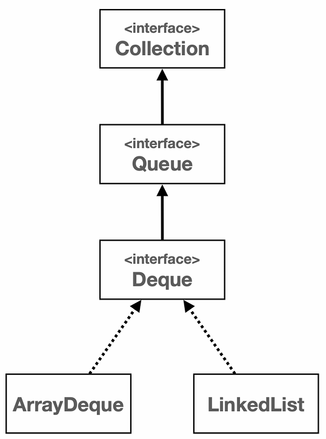

# 컬렉션 프레임워크 - Map(맵)

## 1. Map

---

- Map은 키-값 쌍을 저장하는 자료 구조이다.
- 키는 중복될 수 없지만 값은 중복될 수 있다.
- Map은 순서를 유지하지 않는다.

## 2. 자바가 제공하는 Map - HashMap

---

- 구조 : HashMap은 해시를 사용해서 요소를 저장, 키값은 해시 함수를 통해 해시 코드로 변환되고, 이 해시 코드는 데이터를 저장하고 검색하는 데 사용
- 특징 : 삽입, 삭제, 검색 작업은 해시 자료 구조를 사용하므로 일반적으로 O(1)의 시간 복잡도를 가진다.
- 순서 : 순서를 보장하지 않는다.

## 3. 자바가 제공하는 Map - LinkedHashMap

---
 
- 구조 : 연결 리스트를 사용하여 삽입 순서 또는 최근 접근 순서에 따라 요소를 유지한다.
- 특징 : 입력 순서에 따라 순회가 가능하다.
- 성능 : HashMap과 유사하게 대부분의 작업은 O(1)의 시간 복잡도를 가진다.
- 순서 : 연결 리스트를 사용하기 때문에 입력 순서를 보장한다.

## 4. 자바가 제공하는 Map - TreeMap

---

- 구조 : 레드-블랙 트리를 기반으로 한 구조이다.
- 특징 : 모든 키는 자연 순서 또는 생성자에 제공된 `Comparator`에 의해 정렬된다.
- 성능 : 주요 작업들은 O(log N)의 시간 복잡도를 가진다.
- 순서 : 키는 정렬된 순서로 저장된다.

## 5. 스택 자료구조

---

- LIFO(Last In First Out)
- 자바에서 Stack 클래스는 내부에 Vector라는 자료 구조를 사용한다.
- Vector, Stack 클래스 사용을 지양하고 Deque 클래스를 사용하는 것이 좋다.

## 6. 큐 자료구조

---

- FIFO(First In First Out)

## 7. 데크 자료구조

---

- Deque(Double Ended Queue) : 큐와 스택의 기능을 모두 포함
- 양쪽에서 데이터를 넣고 뺄 수 있다.

