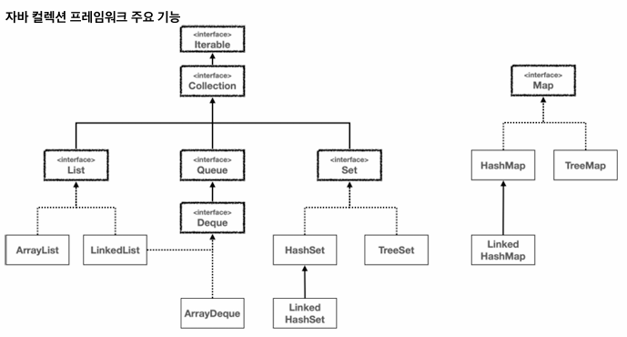

# 컬렉션 프레임워크 - 순회, 정렬, 전체 정리

## 1. Iterable / Iterator

---

- Iterable : "반복 가능한"
- Iterator : 반복자

```java
// Iterator 인터페이스

public interface Iterator<E> {
    boolean hasNext();
    E next();

    default void remove() {
        throw new UnsupportedOperationException("remove");
    }

    default void forEachRemaining(Consumer<? super E> action) {
        Objects.requireNonNull(action);
        while (hasNext())
            action.accept(next());
    }
}
```

```java
// Iterable 인터페이스

public interface Iterable<T> {
    Iterator<T> iterator();

    default void forEach(Consumer<? super T> action) {
        Objects.requireNonNull(action);
        for (T t : this) {
            action.accept(t);
        }
    }

    default Spliterator<T> spliterator() {
        return Spliterators.spliteratorUnknownSize(iterator(), 0);
    }
}
```

## 2. 향상된 for문

---

- JDK 1.5 이상에서 지원
- 배열 인덱스 문제 해결(ArrayIndexOutOfBoundsException 예외)
- 하지만 인덱스를 직접적으로 사용할 수 없다.
- 배열 요소의 값을 순회하면서 출력하는 경우에 적합하다.

```java
// 예시 코드

import java.util.ArrayList;
import java.util.List;

public class Main {
    public static void main(String[] args) {
        List<Integer> lst = new ArrayList<>();

        lst.add(1);
        lst.add(2);
        lst.add(3);
        lst.add(4);
        lst.add(5);

        // 향상된 for문
        for (Integer i : lst) {
            System.out.println("i = " + i);
        }
    }
}
```

## 3. 자바가 제공하는 Iterable, Iterator

---

- 자바 컬렉션 프레임워크 전체 구조를 보게 되면 Collection 인터페이스 위에 Iterable 인터페이스가 있는 것을 볼 수 있다.
- 이 Iterable 인터페이스를 Collection 인터페이스가 상속받고 그 하위 자료구조들이 상속받고 구현체에서 구현되므로 컬렉션 프레임워크는 순회가 가능하다는 것을 알 수 있다.
- 하지만 Map의 경우 Iterable은 불가능한데 이 때, Map에서는 Iterable과 비슷한 기능을 하는 `keySet()`, `values`, `entrySet()` 등을 사용할 수 있다.
- **Iterator(반복자) 디자인 패턴** : 객체 지향 프로그램에서 컬렉션 요소들을 순회할 때 사용하는 디자인 패턴
- 반복자 패턴은 컬렉션 내부 표현 방식을 노출시키지 않으면서도 내부의 각 요소에 대하여 순차적으로 접근할 수 있게 해준다.
- 반복자 패턴은 컬렉션 구현과는 독립적으로 요소들을 탐색할 수 있도록 해주며 코드의 복잡성을 줄이고 재사용성을 높여준다.



```java
// 예시 코드

import java.util.*;

public class Main {
    public static void main(String[] args) {
        // Map 이외 자료구조
        List<Integer> list = new ArrayList<>();
        list.add(1);
        list.add(2);
        list.add(3);

        Iterator<Integer> iterator = list.iterator();
        while (iterator.hasNext()) {
            System.out.println(iterator.next());
        }
        
        // Map 경우 - keySet, values, entrySet
        Map<String, Integer> score = new HashMap<>();
        score.put("홍길동", 90);
        score.put("김개똥", 80);
        score.put("이말년", 70);
        score.put("성춘향", 60);

        Set<String> strings = score.keySet();
        strings.forEach(System.out::println);

        Collection<Integer> values = score.values();
        values.forEach(System.out::println);

        Set<Map.Entry<String, Integer>> entries = score.entrySet();
        entries.forEach(System.out::println);
    }
}
```

## 4. Comparable / Comparator

---

- Comparable : 비교 가능한
- Comparator : 비교자

```java
// a negative integer, zero, or a positive integer as the first argument is less than, equal to, or greater than the second.
public interface Comparator<T> {
    int compare(T o1, T o2);
}
```

- 첫 번째 수가 두 번째 수보다 작으면 -1
- 첫 번째 수와 두 번째 수가 같으면 0
- 첫 번째 수가 두 번째 수보다 크면 1

```java
// 예시 코드

import java.util.Arrays;
import java.util.Comparator;

public class Main {
    public static void main(String[] args) {
        Integer[] array1 = {3, 2, 1};

        // 오름차순 정렬
        Arrays.sort(array1, new AscComparator());
        System.out.println(Arrays.toString(array1));

        Integer[] array2 = {1, 2, 3};

        // 내림차순 정렬
        Arrays.sort(array2, new DescComparator());
        System.out.println(Arrays.toString(array2));
    }


    static class AscComparator implements Comparator<Integer> {

        @Override
        public int compare(Integer o1, Integer o2) {
            return (o1 < o2) ? -1 : (o1 > o2) ? 1 : 0;
        }
    }

    static class DescComparator implements Comparator<Integer> {

        @Override
        public int compare(Integer o1, Integer o2) {
            return (o1 < o2) ? 1 : (o1 > o2) ? -1 : 0;
        }
    }
}
```

- 자바가 기본으로 제공하는 `Integer`, `String`과 같은 래퍼 클래스는 제외하고 `User`와 같은 직접 만든 객체에 대해서 정렬을 하게 되면 문제가 발생한다.
- 이럴 때는 자기 자신과 인수로 넘어온 객체를 비교해서 반환한다.

```java
// Returns:a negative integer, zero, or a positive integer as this object is less than, equal to, or greater than the specified object.
public interface Comparable<T> {
    public int compareTo(T o);
}
```

- 현재 객체가 파라미터로 주어진 객체보다 작으면 -1
- 현재 객체가 파라미터로 주어진 객체와 같다면 0
- 현재 객체가 파라미터로 주어진 객체보다 크다면 1

```java
public class Member implements Comparable<Member> {

    // 나이 기준으로 오름차순 정렬
    @Override
    public int compareTo(Member o) {
        return (this.age < o.age) ? -1 : (this.age > o.age) ? 1 : 0;
    }
}
```

## 5. 선택 가이드

---

- 순서가 중요하고 중복이 허용되는 경우 : List 인터페이스(ArrayList 클래스)
- 중복을 허용하지 않고 순서가 중요하지 않은 경우 : Set 인터페이스(HashSet 클래스)
- 요소를 키-값으로 저장하려는 경우 : Map 인터페이스(HashMap 클래스)
- 요소를 처리하기 전에 먼저 보관해야 하는 경우 : Queue, Deque 인터페이스(ArrayDeque 클래스)