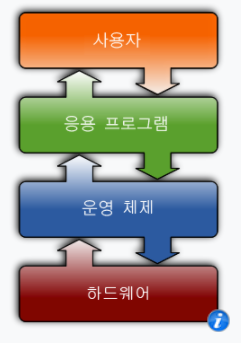
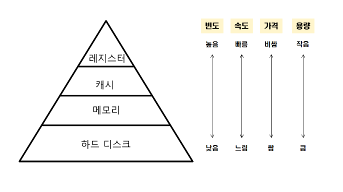
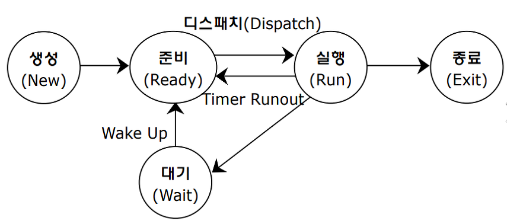

# OS

## 1. 운영체제(Operating System)

   
 예비 답안 보기 (👈 Click)

 

* 하드웨어를 관리하고 응용 프로그램과 하드웨어 사이에서 인터페이스 역할을 하는 소프트웨어

-----------------------

## 2. 커널(Kernel)

   
 예비 답안 보기 (👈 Click)

 

* 커널이란 메모리에 상주하는 운영체제의 핵심 부분이다.

-----------------------

## 3. 시스템 콜(System Call)

   
 예비 답안 보기 (👈 Click)

 

* 사용자 프로그램이 운영체제의 서비스를 받기 위해 커널 함수를 호출하는 것

-----------------------

## 4. 동기식 입출력과 비동기식 입출력

   
 예비 답안 보기 (👈 Click)

 

* 동기식 : I/O 요청 후 입출력 작업이 완료된 후에야 제어가 사용자 프로그램에 넘어감 
* 비동기식 : I/O가 시작된 후 입출력 작업이 끝나기를 기다리지 않고 제어가 사용자 프로그램에 즉시 넘어감

-----------------------

## 5. 인터럽트(Interrupt)

   
 예비 답안 보기 (👈 Click)

 

* 프로그램을 실행하고 있는 도중에 입출력 요청 또는 예외상황을 처리해야 하면 실행하던 프로그램을 멈추고 CPU가 해당 작업을 처리하도록 하는 것을 의미한다.

-----------------------

## 6. 저장장치 계층 구조

   
 예비 답안 보기 (👈 Click)

 

* 레지스터 : CPU가 요청을 처리하는 데 필요한 데이터를 일시적으로 저장하는 기억장치
* 캐시 : 데이터나 값을 미리 복사해 놓는 임시 장소
* 메모리 : 주기억장치
* 하드 디스크 : 비휘발성, 순차적 접근이 가능한 컴퓨터 보조기억장치

-----------------------

## 7. 프로세스와 쓰레드

   
 예비 답안 보기 (👈 Click)

 

* 프로세스
  * 컴퓨터에서 실행 중인 프로그램
  * 각자 고유한 자원과 공간을 할당받는다.
  * 각각의 code, data, stack, heap을 보유
  * 각각의 영역을 가지므로 동기화 작업이 필요하지 않음
  * 각각의 영역을 가지므로 컨텍스트 스위칭 비용이 크다.

* 쓰레드
  * 한 프로세스 내의 실행 단위
  * stack만 고유한 영역을 갖고 나머지 영역은 프로세스 자원을 공유한다.
  * stack 이외 영역을 공유하므로 동기화 작업이 필요
  * stack 이외 영역을 공유하므로 컨텍스트 스위칭 비용이 작다.

* 프로세스의 문맥(context)
  * CPU 수행 상태를 나타내는 하드웨어 문맥
  * 프로세스의 주소 공간 구성
    * code + data + stack
  * 프로세스 관련 커널 자료 구조
    * PCB(Process Control Block, 프로세스 제어 블록)
    * Kernel stack

-----------------------

## 8. 프로세스의 상태

   
 예비 답안 보기 (👈 Click)

 

* Running : CPU를 잡고 instrction을 수행 중인 상태
* Ready : CPU를 기다리는 상태
* Blocked(Waiting) : CPU를 주어도 당장 instruction을 수행할 수 없는 상태
* New : 프로세스가 생성 중인 상태
* Terminated(Exit) : 수행이 끝난 상태

-----------------------

## 9. 프로세스 제어 블록(Process Control Block, PCB)

   
 예비 답안 보기 (👈 Click)

 

* 운영체제가 각 프로세스를 관리하기 위해 프로세스당 유지하는 정보

-----------------------

## 10. 문맥 교환(Context switching)

   
 예비 답안 보기 (👈 Click)

 

* CPU를 한 프로세스에서 다른 프로세스로 넘겨주는 과정
* CPU가 다른 프로세스에게 넘어갈 때, 운영체제는 다음을 수행한다.
  * CPU를 내어주는 프로세스 상태를 그 프로세스 PCB에 저장
  * CPU를 새롭게 얻는 프로세스 상태를 PCB에서 읽어온다.

-----------------------

## 11. 스케줄러

   
 예비 답안 보기 (👈 Click)

 

* Long-term(장기 스케줄러)
  * 시작 프로세스 중 어떤 것들을 ready queue로 보낼지 결정
  * 프로세스에 Memory를 주는 문제
  * degree of Multiprogramming을 제어
  * time sharing system에는 보통 장기 스케줄러가 없음

* Short-term(단기 스케줄러)
  * 어떤 프로세스를 다음 번에 running시킬지 결정
  * 프로세스에 CPU를 주는 문제
  * 충분히 빨라야 함

* Medium-term(중기 스케줄러)
  * 여유 공간 마련을 위해 프로세스를 통째로 메모리에서 디스크로 쫓아냄
  * 프로세스에게서 Memory를 뺏는 문제
  * degree of Multiprogramming을 제어

-----------------------

## 12. 쓰레드 장점

   
 예비 답안 보기 (👈 Click)

 

* 쓰레드를 사용하면 병렬성을 높일 수 있다.
* 동일한 일을 수행하는 다중 쓰레드와 서로 협력하여 높은 처리율과 성능 향상을 얻을 수 있다.
* 하나의 서버 쓰레드가 blocked 상태인 동안에도 동일한 테스크 내의 다른 쓰레드가 실행(running)되어 빠른 처리가 가능하다.

-----------------------

## 13. 프로세스의 특성

   
 예비 답안 보기 (👈 Click)

 

* I/O-bound process : CPU를 잡고 계산하는 시간보다 I/O에 많은 시간이 필요한 Job 
* CPU-bound process : 계산 위주의 process

-----------------------

## 14. CPU 스케줄링

   
 예비 답안 보기 (👈 Click)

 

* 비선점 방식
  * FCFS(First-Come-First-Served)
    * 큐에 도착한 순서대로 실행된다.
    * 비선점형 스케줄링  
    * Convoy effect : 소요시간이 긴 프로세스가 먼저 도착하여 효율성을 낮추는 현상이 발생한다.

  * SJF(Shortest-Job-First)
    * CPU 점유 시간이 가장 짧은 프로세스에게 CPU를 먼저 할당하는 방식
    * 기아 문제 발생 → 사용 시간이 긴 프로세스는 거의 영원히 CPU를 할당받을 수 없다.

* 선점 방식
  * Priority 스케줄링
    * 우선순위가 가장 높은 프로세스에게 CPU를 할당하는 스케줄링
    * 우선순위란 정수로 표현하게 되고 작은 숫자가 우선순위가 높다.
    * 기아 문제 발생 → **솔루션 : 에이징 기법**
    * 에이징 기법 : 우선순위가 낮은 프로세스가 오래 기다리게 된다면 우선순위를 높여주는 방법

  * RR(Round-Robin)
    * 현대적인 CPU 스케줄링
    * 각 프로세스는 동일한 크기의 할당 시간을 갖게 된다.
    * RR은 CPU 사용 시간이 랜덤한 프로세스들이 섞여있을 경우에 효율적이다.
    * 시간 할당량을 매 프로세스에게 주고 할당된 시간 안에 완료하지 못한 프로세스는 레디 큐의 맨 뒤에 배치하는 방식

  * Shortest Remaining Time First(SRTF)
    * CPU 점유 시간이 가장 짧은 프로세스에 CPU를 먼저 할당하는 방식
    * SJF 방식과 다른 점이 있다면 선점 방식이라는 것
    * 기아 문제 발생

-----------------------

## 15. 경쟁 상태(Race Condition)

   
 예비 답안 보기 (👈 Click)

 

* 두 개 이상의 프로세스가 공통 자원을 병렬적으로 읽거나 쓰는 동작을 할 때, 공용 데이터에 대한 접근 순서에 따라 결과가 달라지는 현상

-----------------------

## 16. 임계 구역(Critical Section)

   
 예비 답안 보기 (👈 Click)

 

* 동일한 자원에 접근하는 코드 영역

-----------------------

## 17. 임계 구역 해결 - 프로그램적 해결법의 충족 조건

   
 예비 답안 보기 (👈 Click)

 

* 상호 배제(Mutual Exclusion)
  * 프로세스 P1이 임계 구역에서 실행 중이라면 다른 프로세스들은 그들이 가진 임계 구역에서 실행될 수 없다.

* 진행(Progress)
  * 임계 구역에 아무것도 없는 상태에서 임계 구역에 들어가고자 하는 프로세스가 있다면 임계 구역에 들어가게 해주어야 한다.

* 유한 대기(Bounded Waiting)
  * 프로세스가 임계 구역에 들어가려고 요청한 후부터 그 요청이 허용될 때까지 다른 프로세스들이 임계 구역에 들어가는 횟수에 한계가 있어야 한다.

-----------------------

## 18. 임계 구역 해결 - 해결 방법

   
 예비 답안 보기 (👈 Click)

 

* 세마포어(Semaphores)
  * 소프트웨어상에서 임계 구역 문제를 해결하기 위한 동기화 도구
  * 현재 수행중인 프로세스가 아닌 다른 프로세스가 세마포어를 해제할 수 있다.

* 뮤텍스(Mutex)
  * 동시에 공유자원에 접근하는 것을 막기 위해 임계 구역에 진입하는 프로세스는 Lock을 획득하고 임계 구역을 빠져나올 때, Lock을 방출함으로써 동시에 접근이 되지 않도록 한다.

-----------------------

## 19. 교착 상태(Deadlock)

   
 예비 답안 보기 (👈 Click)

 

* 두 개 이상의 프로세스나 쓰레드가 서로 자원을 기다리면서 무한정 대기하는 상태
  * 발생 조건
    * 상호 배제 : 한 자원에 여러 프로세스가 동시에 접근할 수 없다.
    * 점유 대기 : 하나의 자원을 소유한 상태에서 다른 자원을 기다린다.
    * 비선점 : 프로세스가 어떤 자원의 사용을 끝낼 때까지 프로세스의 자원을 뺏을 수 없다.
    * 환형 대기 : 각 프로세스가 순환적으로 다음 프로세스가 요구하는 자원을 갖고 있다.

→ 자원 할당 그래프에서 사이클이 발생하지 않는다면 데드락이 아니다.
 
→ 만약 리소스 타입이 여러 가지라면 데드락의 가능성을 염두에 두어야 하고 리소스 타입이 하나라면 데드락이 발생하게 된다.

-----------------------

## 20. 모니터(Monitor)

   
 예비 답안 보기 (👈 Click)

 

* 고급 언어 설계 구조물로서 개발자 코드를 상호배제 하게끔 만든 추상화된 데이터 형태이다.
* 공유 자원에 접근하기 위한 키 획득과 자원 사용 후 해제를 모두 처리한다.(세마포어는 직접 키 해제와 공유 자원 접근 처리를 필요로 한다.)

-----------------------

## 21. 교착 상태 해결 방법   

   
 예비 답안 보기 (👈 Click)

 

* 예방
  * 교착상태 발생 조건 중 하나를 제거함으로 데드락이 발생하지 않도록 예방
  * 자원 낭비가 심하다.
* 회피 
  * 데드락 발생 가능성을 인정하면서도 적절하게 회피하는 방식
  * 은행원 알고리즘
    * 프로세스가 자원을 요구할 때 시스템은 자원을 할당한 후에도 안정 상태로 남아있게 되는지를 사전에 검사하는 알고리즘
* 탐지와 회복
  * 데드락 발생은 허용하되 그에 대한 탐지 루틴을 두어 데드락 발견시 회복
* 무시
  * 데드락을 시스템이 책임지지 않는다.

-----------------------

